# Detected and Responded to an SSH Brute-Force Attack Using Splunk>

## 📌 Overview

This project simulates a real-world **Security Operations Center (SOC)** scenario by detecting and responding to an SSH brute-force attack.

The lab demonstrates how security analysts monitor logs, detect malicious behavior, generate alerts, and visualize attack patterns using a SIEM platform.

The attack is simulated using a controlled environment and analyzed in Splunk through log ingestion, detection logic, alerting, and dashboarding.

---

## 🎯 Objectives

* Simulate an SSH brute-force attack
* Ingest system logs into Splunk using a forwarder
* Detect attack patterns using SPL (Splunk Processing Language)
* Create real-time alerts based on attack thresholds
* Enrich alerts with contextual data (IP, time, location)
* Visualize attack behavior in a SOC-style dashboard
* Perform basic incident response (IP blocking)

---

## Lab Architecture

| Component      | Role                                      |
| -------------- | ----------------------------------------- |
| Kali Linux     | Attacker (Hydra brute-force attack)       |
| Ubuntu         | Victim (SSH server + log source)          |
| Splunk (Vultr) | SIEM (log ingestion, detection, alerting) |

---

## Attack Simulation

A brute-force SSH attack was executed from Kali Linux using Hydra:

```bash
hydra -l testuser -P /usr/share/wordlists/rockyou.txt ssh://192.168.69.2 -t 4
```

This generated multiple failed login attempts recorded in:

```bash
/var/log/auth.log
```

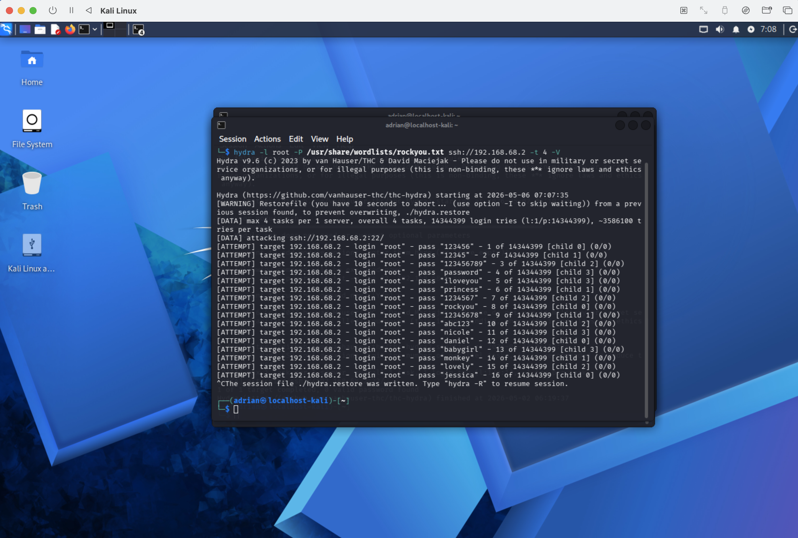

---

## Log Ingestion

Splunk Universal Forwarder was installed on the Ubuntu machine and configured to monitor:

```bash
/var/log/auth.log
```

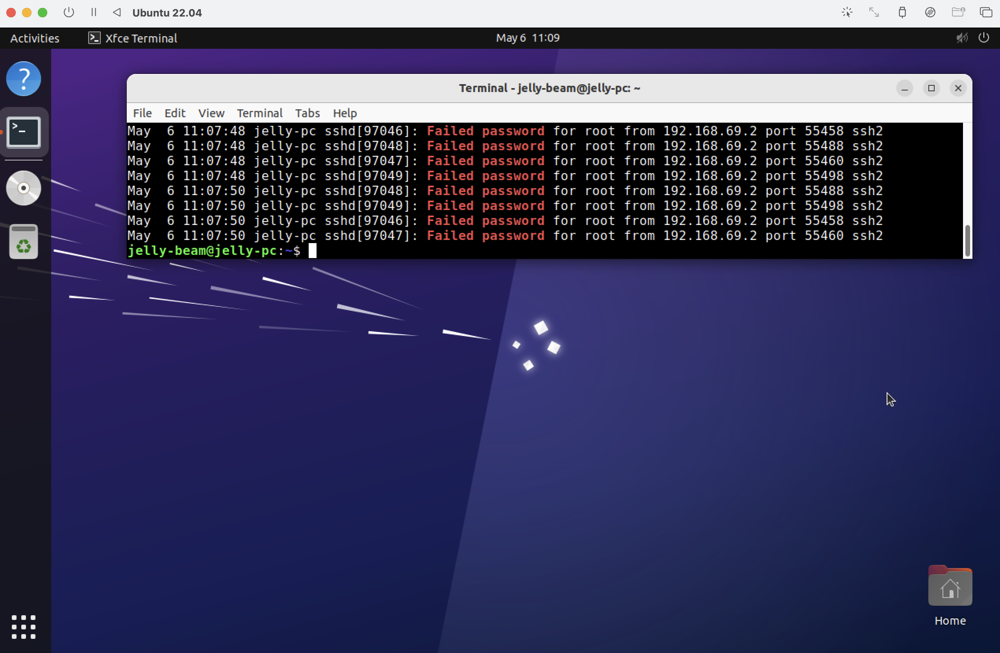

Logs were forwarded to the Splunk server (Vultr) over port **9997**.

---

## Detection Engineering

### SPL Query (Brute Force Detection)

```spl
index=* "Failed password"
| rex "from (?<src_ip>\d+\.\d+\.\d+\.\d+)"
| bin _time span=1m
| stats count by _time, src_ip
| where count > 5
| eval alert_time=strftime(_time, "%Y-%m-%d %H:%M:%S")
```
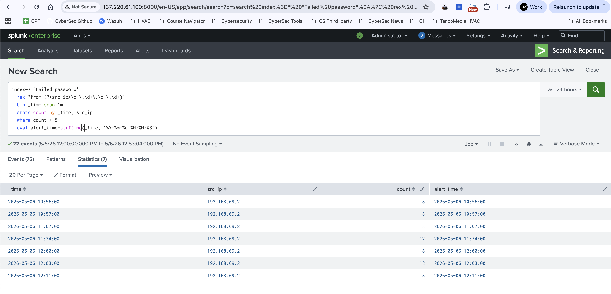


### Detection Logic

* Extract source IP from logs
* Group events into 1-minute intervals
* Count failed login attempts per IP
* Trigger when attempts exceed threshold (>5)


## Incident Response

After detecting the attack, the malicious IP was blocked using IPTABLES:

```bash
sudo iptables -A INPUT -s 192.168.69.2 -j DROP
```

Verification:

```bash
sudo iptables -L -n
```

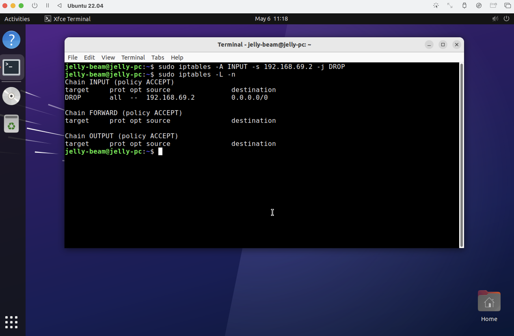

---

## 🚨 Alerting

A Splunk alert was configured with:

* **Trigger:** Number of results > 0
* **Schedule:** Every 1 minute
* **Time range:** Last 5 minutes
* **Trigger mode:** Per result

### Alert Enrichment

```text
🚨 SSH Brute Force Detected from $result.src_ip$
Time: $result.alert_time$
Source IP: $result.src_ip$
Country: $result.Country$
City: $result.City$
Failed Attempts: $result.count$
```
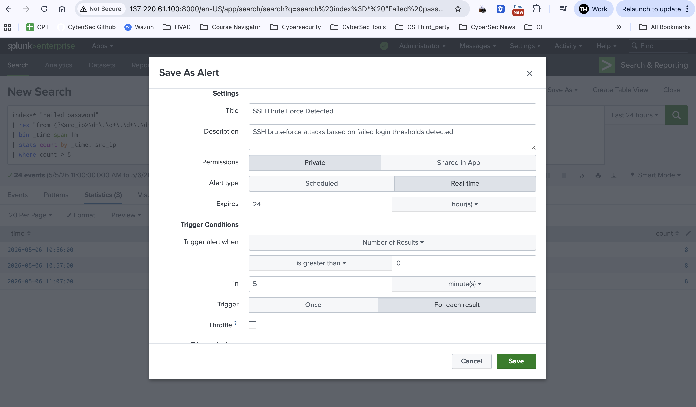

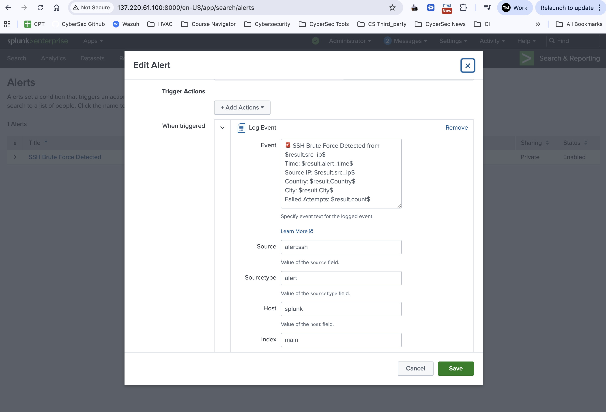

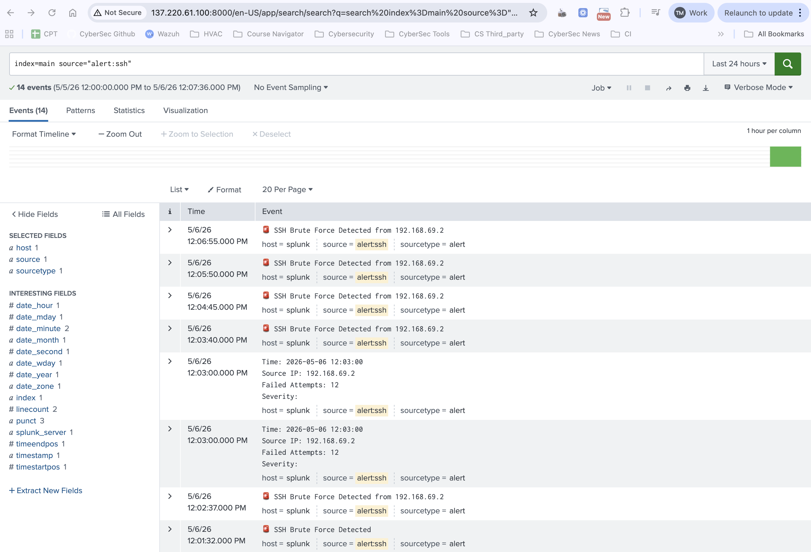

---

## GeoIP Enrichment

To add contextual intelligence, IP addresses were enriched using:

```spl
| iplocation src_ip
```

This adds:

* Country
* City
* Geographic context for attacker origin

Full spl query
```index=* "Failed password"
| rex "from (?<src_ip>\d+\.\d+\.\d+\.\d+)"
| eval src_ip=if(src_ip="192.168.69.2","8.8.8.8",src_ip)
| iplocation src_ip
| bin _time span=1m
| stats count by _time, src_ip, Country, City
| where count > 5
| eval alert_time=strftime(_time, "%Y-%m-%d %H:%M:%S")```

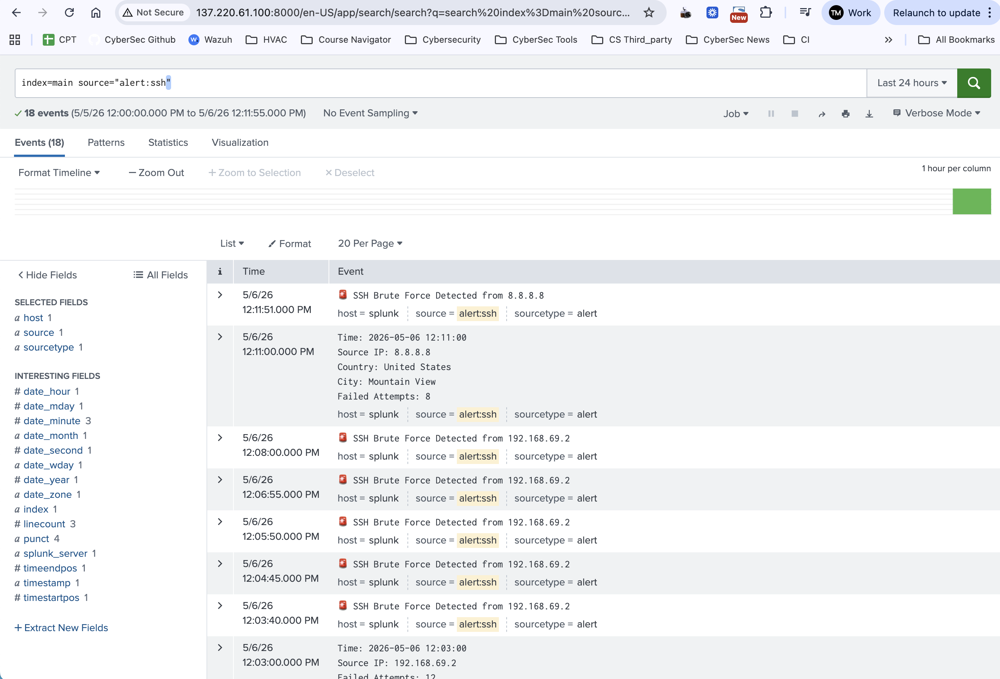

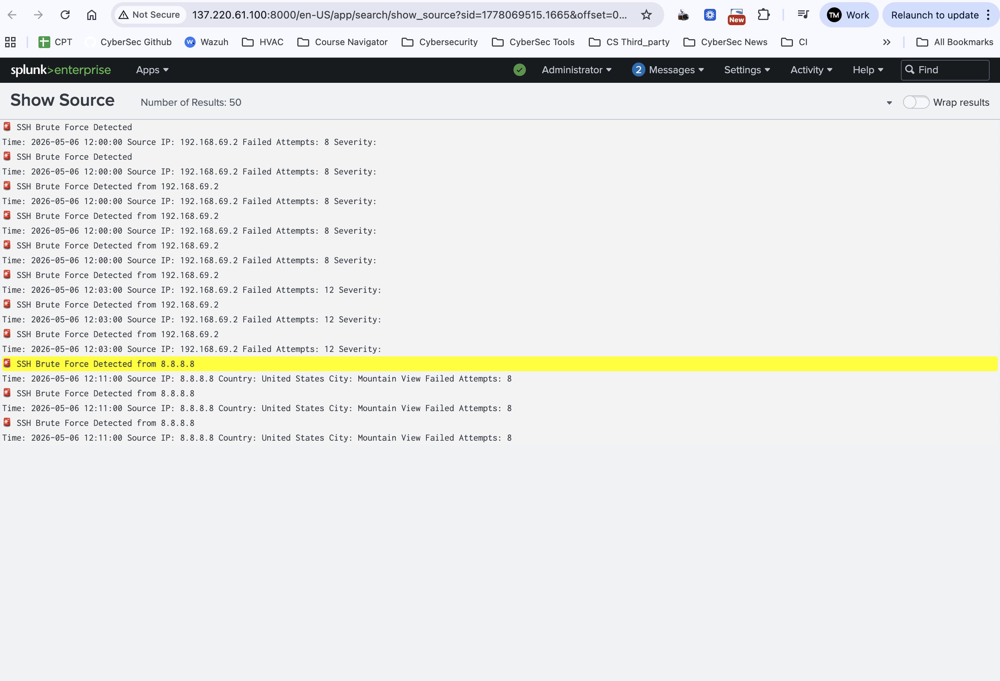

---

## SOC Dashboard

A Splunk dashboard was created to visualize attack activity.

### Failed Logins Over Time

```spl
index=* "Failed password"
| timechart span=1m count
```

📸 **Failed Passwords:**
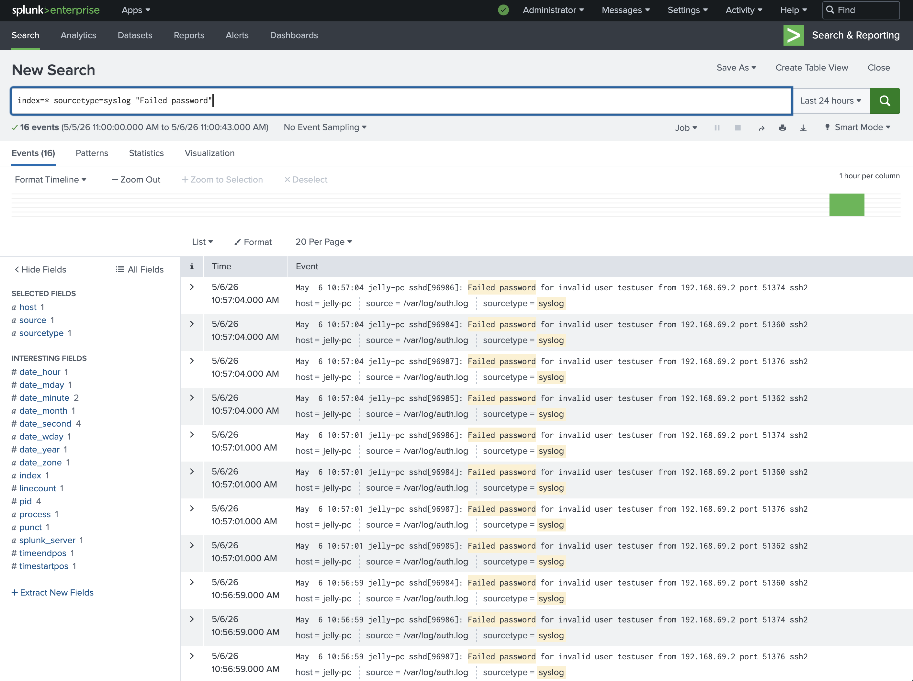

---

### Query Top Attacking IPs

```spl
index=* "Failed password"
| rex "from (?<src_ip>\d+\.\d+\.\d+\.\d+)"
| stats count by src_ip
| sort -count
```

---

### Query Attacks by Country (GeoIP)

```spl
index=* "Failed password"
| rex "from (?<src_ip>\d+\.\d+\.\d+\.\d+)"
| iplocation src_ip
| stats count by Country
```

---

### 🚨 Triggered Alerts

```spl
index=main source="alert:ssh_bruteforce"
```


📸 **SSH Brute Force Attack Simple Dashboard:**
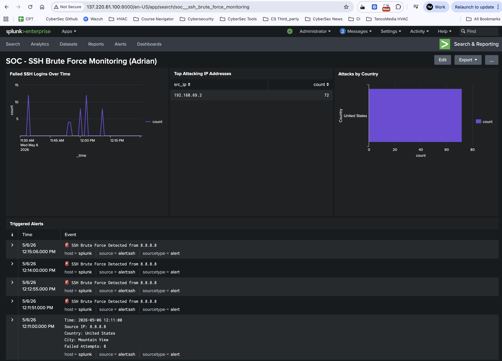

---

## Threat Narrative / Incident Report

**Incident Summary**

On May 6, 2026, a potential SSH brute-force attack was detected targeting the Ubuntu server. A high volume of failed login attempts was observed within short time intervals, triggering alerts in Splunk based on predefined detection thresholds.

The activity pattern is consistent with an automated credential brute-force attack.

**Detection Details**
- Detection Method: SPL query with threshold-based logic
- Trigger Condition: More than 5 failed login attempts per IP within 1 minute
- SIEM Platform: Splunk


**Affected Assets**
- Target System: Ubuntu Server (SSH service)
- Log Source: `/var/log/auth.log`
- Log Ingestion: Splunk Universal Forwarder

**Attacker Details**

| Attribute        | Value                         |
| ---------------- | ----------------------------- |
| Source IP        | 192.168.69.2, 8.8.8.8         |
| Attack Type      | SSH Brute Force               |
| Failed Attempts  | 8–12 attempts per interval    |
| Behavior Pattern | Rapid repeated login attempts |


**Geolocation Intelligence**

Using Splunk GeoIP enrichment:

- Country: **United States**
- City: **Mountain View**

**Attack Timeline**
- Initial Activity: **~12:00 PM**
- Peak Activity: **~12:11 PM**
- Alert Triggered: **Multiple times within minutes**
- Duration: **Approximately 10 minutes**


**Impact Assessment**
- No successful login detected
- No confirmed system compromise
- Repeated unauthorized access attempts observed
- Risk Level: Medium

**Response Actions**
- Identified malicious IP address(es)
- Blocked attacker using **IPTABLES**
- Continued monitoring via Splunk dashboard

---

## SOC Workflow Demonstrated

1. **Detection** — Identify brute-force behavior via log analysis
2. **Analysis** — Extract attacker IP and evaluate impact
3. **Alerting** — Generate real-time alerts in Splunk
4. **Enrichment** — Add contextual data (GeoIP)
5. **Response** — Block malicious IP
6. **Visualization** — Monitor attacks via dashboard

---

## Key Skills Demonstrated

* SIEM (Splunk) log ingestion and monitoring
* SPL query development and detection logic
* Field extraction using regex (`rex`)
* Alert engineering and enrichment
* Dashboard creation and visualization
* Basic incident response and containment
* Understanding of brute-force attack patterns

---

## Future Improvements

* Automate IP blocking via Splunk alert actions
* Integrate MITRE ATT&CK mapping (T1110 - Brute Force)
* Add anomaly-based detection
* Expand to multi-host attack simulation
* Integrate EDR logs for endpoint visibility

---

## 💬 Summary

This project demonstrates a complete SOC workflow from attack simulation to detection, alerting, and response. It highlights practical skills required for entry-level SOC Analyst roles and reflects real-world security monitoring scenarios.

Author: **Adrian Tanase**
