# Windows Lateral Movement & Threat Detection Lab
## Splunk + Sysmon + Kali Linux SOC Detection Project

---

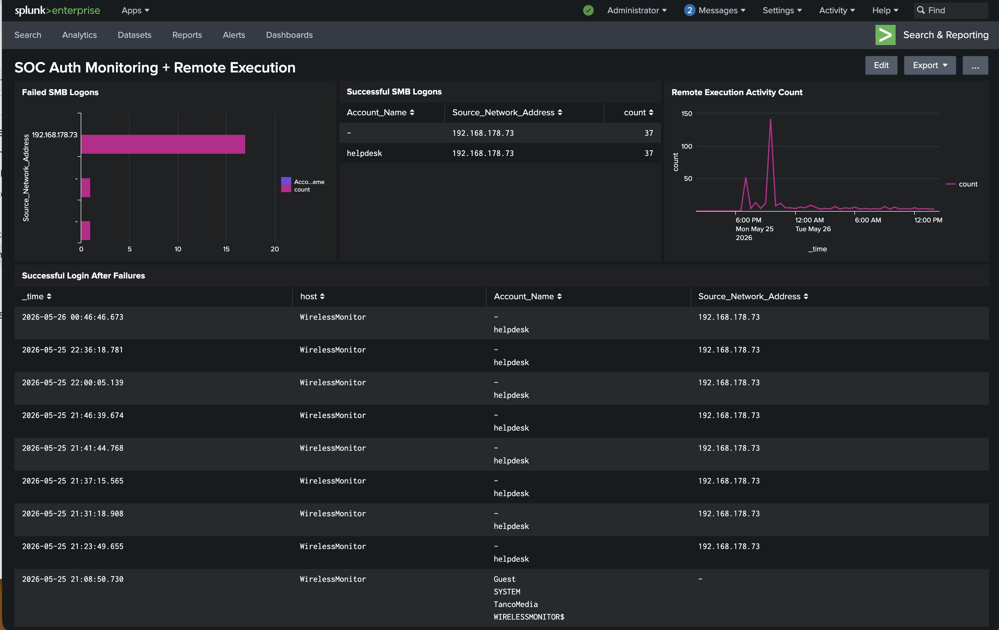

# 📌 Project Overview

**This lab simulates a realistic Windows lateral movement intrusion inside a controlled SOC environment using Kali Linux, Windows 10, Sysmon, and Splunk Enterprise.**

The objective of the project was to generate real attacker telemetry, investigate malicious activity, and practice detection engineering using enterprise logging tools.

**The environment includes:**

- **Kali Linux** as the attacker machine
- **Windows 10** as the victim workstation
- **Splunk Enterprise** as the SIEM
- **Sysmon** for advanced endpoint telemetry
- **Splunk Universal Forwarder** for centralized log ingestion

**The attack simulation mirrors techniques commonly observed during::**

- Simulate attacker behavior
- Generate realistic Windows telemetry
- Detect malicious activity in Splunk
- Perform threat hunting using Sysmon and Windows Event Logs
- Build practical SOC analyst and detection engineering skills

**This project mirrors techniques commonly used during:**

- Ransomware intrusions
- Internal network compromise
- SMB lateral movement
- Administrative abuse
- PowerShell-based attacks

---

### Lab Architecture

#### Environment

| Machine | Role |
|---|---|
| Kali Linux VM | **Attacker** |
| Windows 10 Workstation | **Victim** |
| Splunk Enterprise | **SIEM** |
| Sysmon | **Endpoint telemetry** |
| Splunk Universal Forwarder | **Log forwarding** |

---

### Network Layout

```text
Kali Linux VM
192.168.178.73
        |
        |
        v
Windows 10 Workstation
192.168.178.37
        |
        |
        v
Splunk Enterprise SIEM
```

---

### Tools Used

#### Offensive Tools

| Tool | Purpose |
|---|---|
| **CrackMapExec** | SMB authentication & remote execution |
| **Impacket-PsExec** | Remote execution & lateral movement |
| **Hydra** | Brute force testing |
| **Nmap** | Service enumeration |
| **FreeRDP** | RDP ports testing |

---

#### Defensive Tools

| Tool | Purpose |
|---|---|
| **Sysmon** | Advanced Windows telemetry |
| **Splunk Enterprise** | SIEM platform |
| **Splunk Universal Forwarder** | Log forwarding |

---

### Windows Logging Configuration

#### Security Event Logging

Enabled logging for:

| Event ID | Description |
|---|---|
| 4624 | Successful logon |
| 4625 | Failed logon |
| 4648 | Explicit credential logon |
| 4672 | Special privileges assigned |

---

#### Sysmon Logging

Enabled:

| Event ID | Description |
|---|---|
| 1 | Process creation |
| 3 | Network connection |
| 10 | Process access |

---

#### PowerShell Logging

Enabled:

| Event ID | Description |
|---|---|
| 4104 | Script Block Logging |

---

## Incident Response Process (NIST Framework)

This investigation follows the NIST Incident Response Framework: **Preparation → Detection → Analysis → Containment → Eradication → Recovery → Lessons Learned**

---

### Step 1 — Victim User Creation

Three new local users were created on the Windows 10 workstation to simulate realistic enterprise user accounts during the attack simulation.

These accounts were later targeted during SMB authentication and remote execution testing.

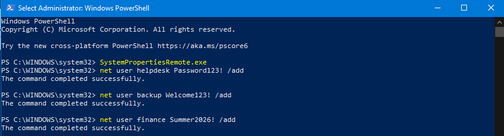

**Why This Matters**

Realistic user accounts allow authentication telemetry to closely resemble real enterprise attack activity. Attackers commonly target valid usernames during password spraying, brute force attempts, and lateral movement operations.

Creating multiple users also improves detection testing for:

- Failed authentication attempts
- Successful logons
- Account targeting patterns
- Source IP correlation


---

### Step 2 — Splunk Universal Forwarder Verification

The Splunk Universal Forwarder was verified locally after installation and configuration to ensure Windows logs were successfully being forwarded into Splunk Enterprise.

```powershell
Get-Service SplunkForwarder
```

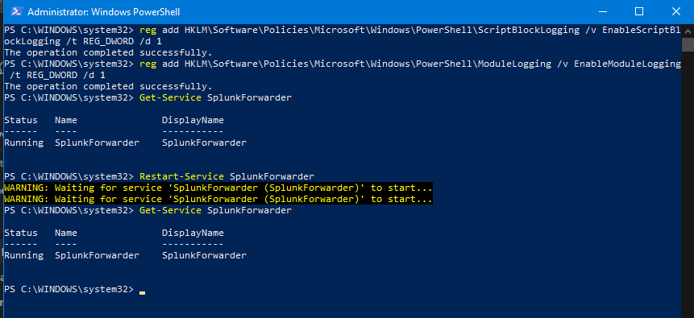

**Result**

The SplunkForwarder service was confirmed running successfully.

**Why This Matters**

Without log forwarding, endpoint telemetry never reaches the SIEM platform. Verifying the forwarder ensures that authentication events, Sysmon logs, and process creation telemetry are centrally searchable during investigations.

In real SOC environments, broken log forwarding creates major visibility gaps during incident response.

---

### Step 3 — Sysmon Telemetry Verification

Sysmon logging was validated locally to confirm advanced endpoint telemetry was being generated correctly.

```powershell
Get-WinEvent -LogName "Microsoft-Windows-Sysmon/Operational" -MaxEvents 5
```

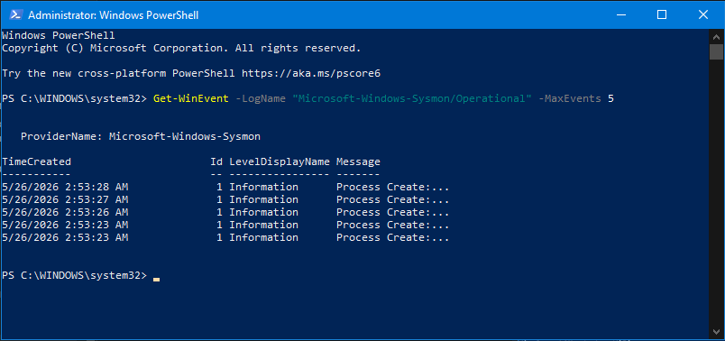

**Result**

Successfully confirmed:

- Process Create events
- Network Connection events
- Parent-child process telemetry

**Why This Matters**

Sysmon provides significantly deeper visibility than default Windows logging. It allows defenders to detect attacker behavior such as:

- Remote command execution
- PowerShell abuse
- Suspicious parent-child relationships
- Lateral movement activity

Without Sysmon, many advanced attack techniques remain difficult to investigate.

---

### Step 4 — Splunk Add-on Installation

**Installed:**

- Splunk Add-on for Microsoft Sysmon ( https://splunkbase.splunk.com/app/5709 )
- Splunk Add-on for Microsoft Windows ( https://splunkbase.splunk.com/app/742 )

**Benefits:**

The add-ons provided:
- Proper field extraction
- CIM normalization
- Better searches
- Security dashboards

**Why This Matters**

Raw Windows logs can be difficult to analyze at scale. Proper field extraction and normalization allow analysts to build cleaner detections, reusable dashboards, and faster investigations.

Detection engineering heavily depends on normalized telemetry.

---

## Attack Simulation

### Step 5 — SMB Authentication Attack Simulation

SMB authentication attacks were simulated from the Kali Linux attacker machine against the Windows 10 workstation using CrackMapExec.

#### Attack Command on Kali

```python
crackmapexec smb 192.168.178.37 -u users.txt -p passwords.txt
```
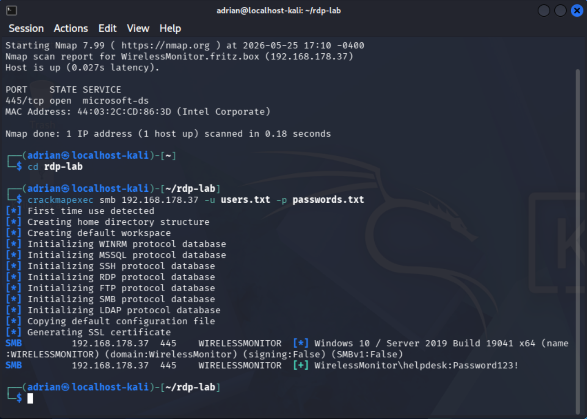

**Result**

The attack generated both successful and failed authentication attempts against the Windows host.

#### Successful Authentication Example

```python
crackmapexec smb 192.168.178.37 -u helpdesk -p 'Password123!'
```

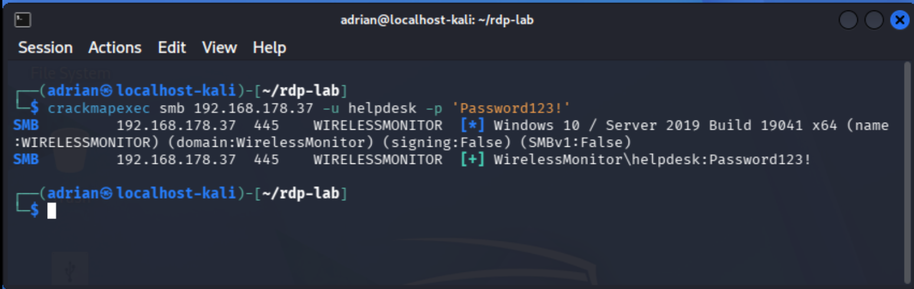

---

#### Telemetry Generated

The attack generated:

- Event ID 4624
- Event ID 4625
- NTLM authentication activity
- Source IP visibility
- SMB logon events

---

#### Detection Query in Splunk


```sql
index=* EventCode=4625
| stats count by Source_Network_Address Account_Name
```

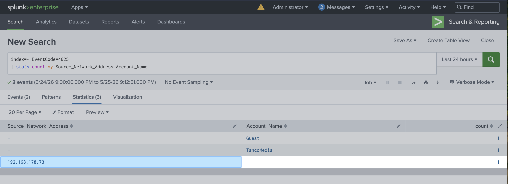

**Why This Matters**

Failed SMB authentication spikes are commonly associated with:

- Password spraying
- Brute force attacks
- Credential stuffing
- Initial access attempts

Tracking source IP addresses and targeted usernames helps analysts identify attacker infrastructure and compromised accounts during investigations.

---

### Step 6 — Remote Command Execution

Remote command execution was simulated over SMB using CrackMapExec.

#### Attack Command on Kali

```sql
crackmapexec smb 192.168.178.37 -u helpdesk -p 'Password123!' -x "whoami"
```

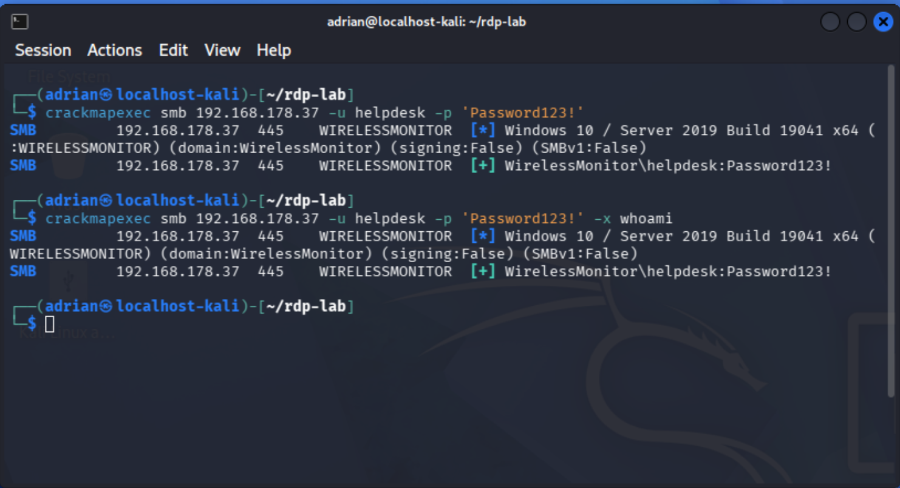

**Result**

The command executed remotely on the Windows system through service-based execution.

**Telemetry Generated**

The attack generated:

- Sysmon Event ID 1
- `cmd.exe` execution
- `services.exe` parent-child chains
- Remote process execution artifacts

---

#### Detection Query

```sql
index=* EventCode=1
ParentImage="*services.exe"
| table _time host ParentImage Image CommandLine User
```

---

***Why This Detection Matters***

This behavior is strongly associated with:

- PsExec
- Impacket
- CrackMapExec
- SMBExec
- Ransomware lateral movement

---

### Step 7 — Encoded PowerShell Execution

Encoded PowerShell execution was simulated to generate realistic attacker PowerShell telemetry.

#### Encoded PowerShell Command

```sql
powershell -enc dwBoAG8AYQBtAGkA
```

(Base64 decodes to: `whoami`)

---

#### Remote Execution Command on Kali

```python
crackmapexec smb 192.168.x.x -u helpdesk -p 'Password123!' -x "powershell -enc dwBoAG8AYQBtAGkA"
```

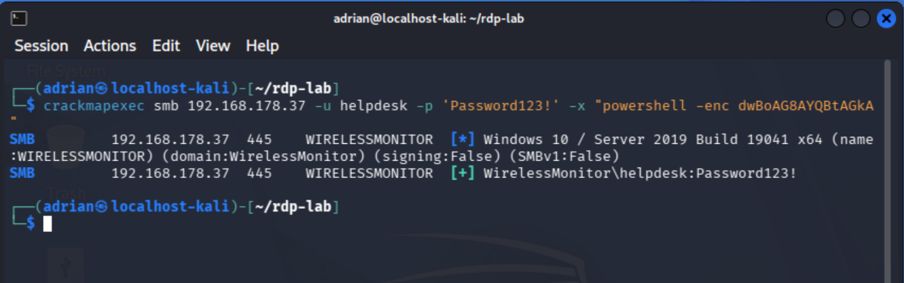

**Telemetry Generated**

The attack generated:

- `powershell.exe` execution
- Encoded command visibility
- Sysmon process creation logs

---

### PowerShell Detection Queries

#### Detection Query — PowerShell Execution

```sql
index=* EventCode=1 Image="*powershell.exe"
| table _time host User ParentImage CommandLine
```

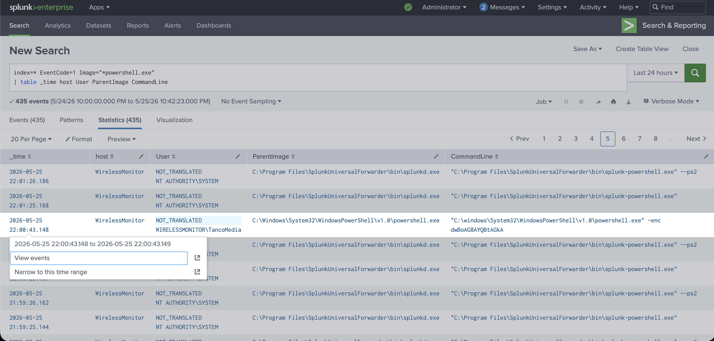

---

#### Detection Query — Encoded PowerShell

```sql
index=* EventCode=1
Image="*powershell.exe"
(CommandLine="*-enc*" OR CommandLine="*EncodedCommand*")
| table _time host User ParentImage CommandLine
```
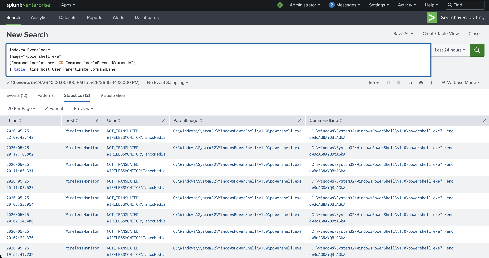

**Why This Matters**

Attackers commonly use encoded PowerShell commands to:

- Obfuscate malicious payloads
- Evade simple detections
- Download malware
- Execute fileless attacks

Encoded PowerShell is considered a high-value hunting indicator in enterprise environments.

---

### Step 8 — Process Creation Threat Hunting

Threat hunting focused on identifying suspicious parent-child process relationships generated during lateral movement activity.

##### Important Parent-Child Relationships

`services.exe` → `cmd.exe` or other random EXE files

---

#### Detection Query

```sql
index=* EventCode=1
ParentImage="*services.exe"
| table _time host User ParentImage Image CommandLine
```

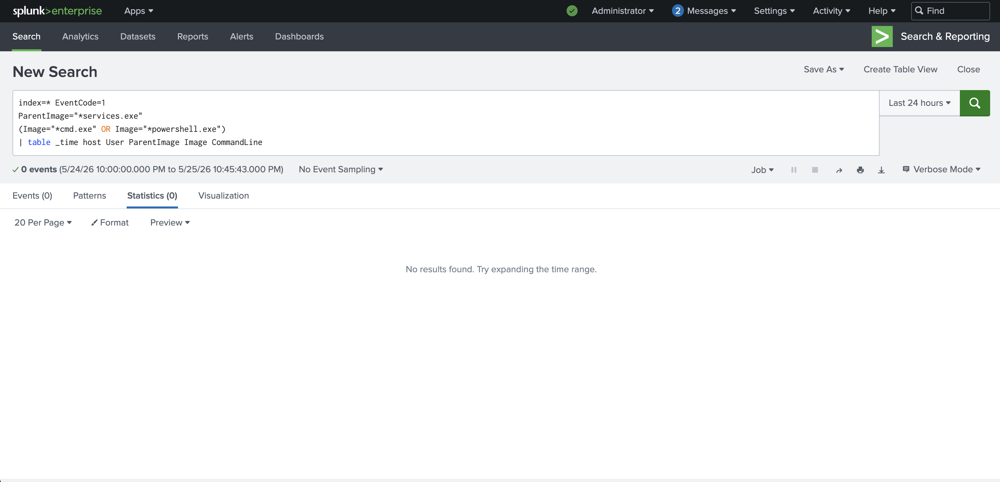


**Even better detection**

```sql
index=* EventCode=1
ParentImage="*services.exe"
(
Image="C:\\Windows\\*.exe"
OR Image="*cmd.exe"
OR Image="*powershell.exe"
)
| table _time host User ParentImage Image CommandLine
| sort - _time
```
Detect suspicious executables launched from Windows directory:

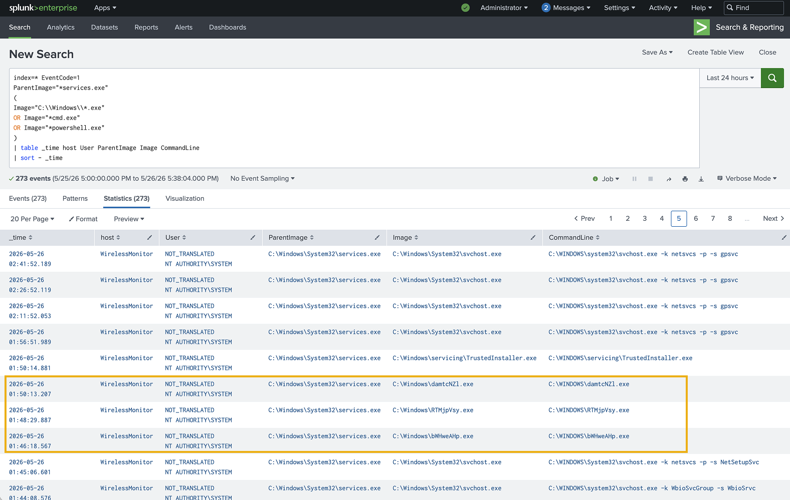

**Result**

Threat hunting identified suspicious service-based execution where `services.exe` ***spawned a randomly named executable under the Windows directory***. This behavior closely resembles ***PsExec/Impacket lateral movement*** commonly associated with ransomware operations and remote administrative abuse.

**In Our Case:**

```
damtcNZ1.exe
RTMjpVsy.exe
bWHweAHp.exe
```

**Why This Is Suspicious**

Legitimate Windows services usually launch:

```
svchost.exe
dllhost.exe
service binaries in Program Files
```
NOT:
```
C:\Windows\random.exe
```

The *random* EXE THEN launches cmd/powershell internally.
   
**Randomly named executables** under Windows directory spawned by `services.exe` are **HIGHLY suspicious**.

**Why This Matters**

This process relationship is highly suspicious and commonly associated with:

- Lateral movement
- Remote execution
- PsExec-style execution
- Administrative abuse

Parent-child process analysis is one of the most valuable techniques in endpoint threat hunting because it reveals how processes were launched and what initiated them.

---

### Step 9 — SMB Authentication Detection

**Successful and failed SMB logons** were investigated using **Windows Security Event Logs**.

#### Successful SMB Logons Detection Query

```sql
index=* EventCode=4624 Logon_Type=3
| table _time host Account_Name Source_Network_Address Authentication_Package
```

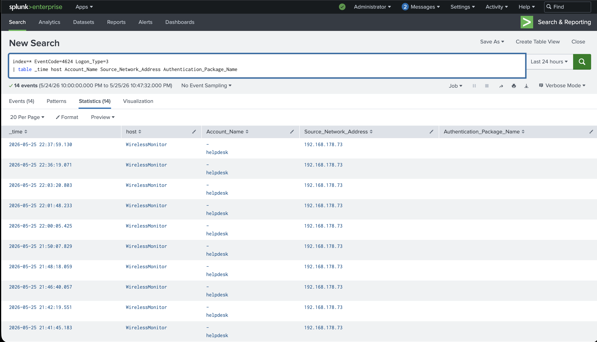

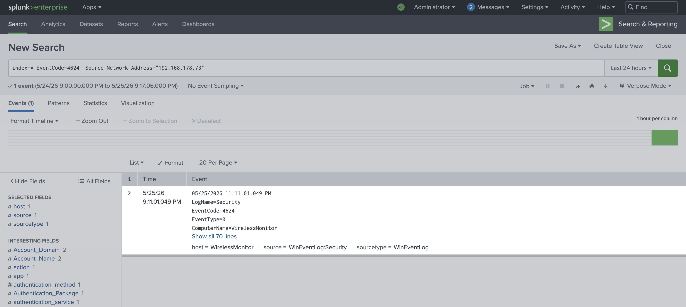

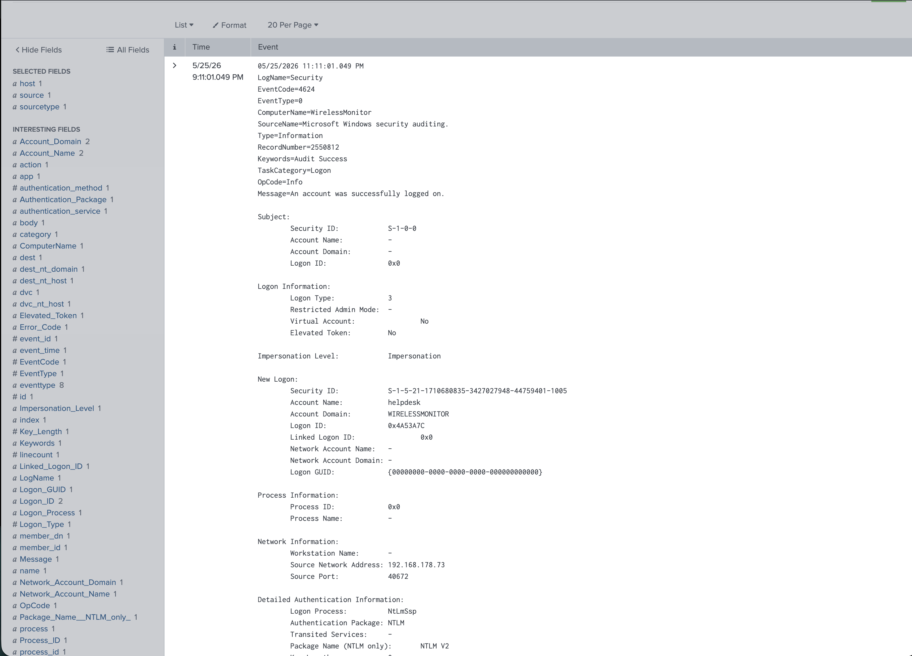

**Why This Matters**

**Logon Type 3** events indicate **remote network authentication activity**. 

We can use these events to identify:

- Lateral movement
- Remote administrative access
- Suspicious authentication sources
- Potential compromised accounts

---

#### Failed SMB Logons Detection Query

```sql
index=* EventCode=4625 Logon_Type=3
| stats count by Source_Network_Address Account_Name
| where count > 5
```

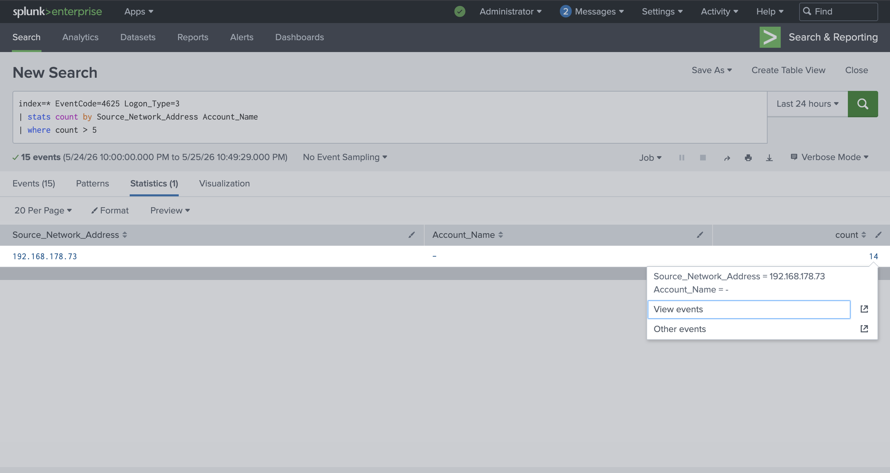

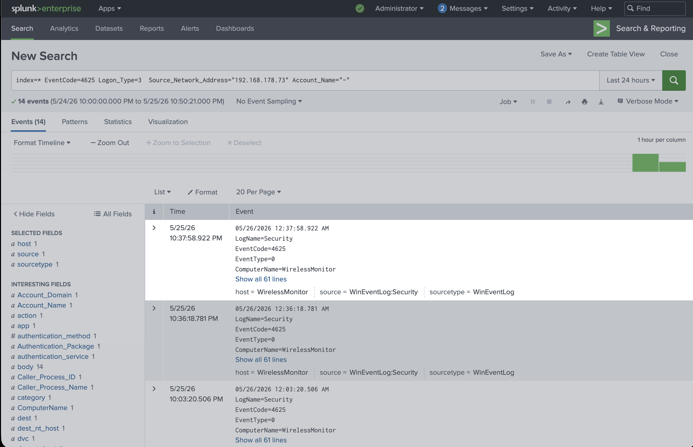

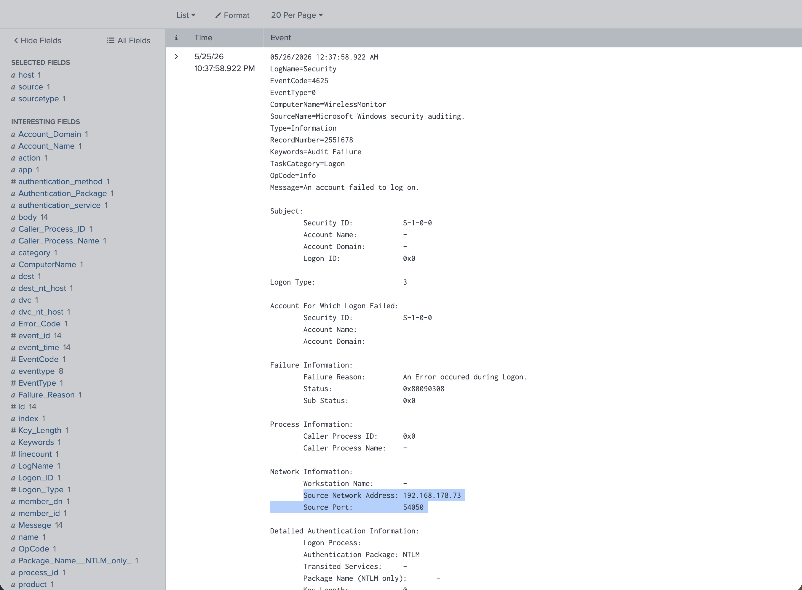

**Why This Matters**

Multiple failed SMB logons from the same source are commonly associated with **brute force or password spraying attacks**.

Repeated failures against multiple accounts often indicate **active attacker reconnaissance or credential attacks**.

---

### Step 10 — Detecting Successful Login After Failed Attempts

A transaction-based Splunk search was used to identify successful logins occurring shortly after multiple failed authentication attempts.

```sql
index=* (EventCode=4624 OR EventCode=4625)
| transaction Source_Network_Address maxspan=5m
| search EventCode=4625 EventCode=4624
| table _time host Account_Name Logon_Type Source_Network_Address EventCode
```

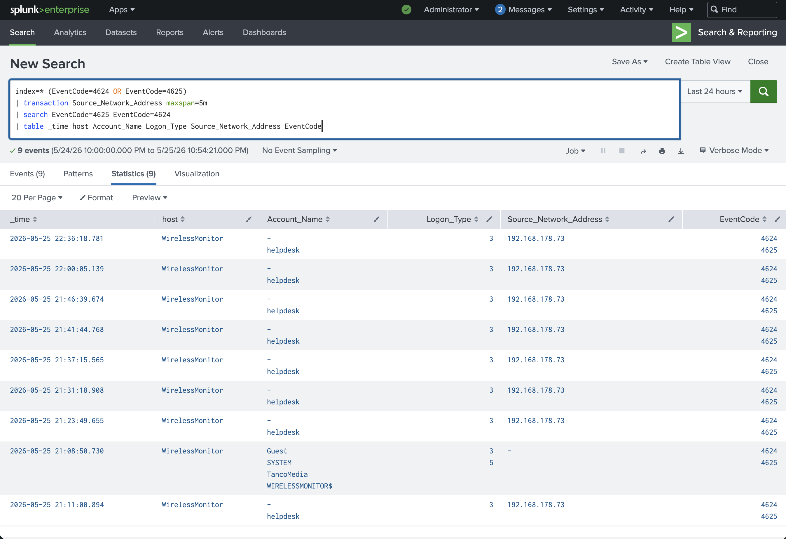

**Why This Matters**

This detection identifies a common attacker pattern:

- Multiple failed password attempts
- Eventual successful authentication
- Potential account compromise

Correlating failed and successful authentication events is a powerful technique for detecting credential attacks.


### Step 11 — Splunk Alert Creation for SMB Lateral Movement Detection

After validating the detection logic for suspicious SMB-based remote execution, a dedicated Splunk alert was created to automatically detect potential lateral movement activity associated with tools such as:

```sql
Impacket PsExec
CrackMapExec
SMBExec
PsExec-style ransomware behavior
```

**The alert correlates:**

- Successful SMB authentication (`Event ID 4624`)
- NTLM network logons
- Suspicious process execution
- `services.exe` spawning unexpected executables

**Detection Logic**

```sql
The following SPL query was used:
index=* (
(EventCode=4624 Logon_Type=3 Authentication_Package=NTLM)
OR EventCode=1
)
| transaction host maxspan=2m
| search ParentImage="*services.exe"

Image="C:\\Windows\\*.exe"

NOT Image IN (
"C:\\Windows\\System32\\svchost.exe",
"C:\\Windows\\System32\\dllhost.exe"
)

| eval severity="high"
| eval technique="T1021.002 - SMB Admin Shares"
| eval detection="Potential Lateral Movement"

| table _time host User Account_Name Source_Network_Address ParentImage Image CommandLine
| sort - _time
```

**Splunk Alert Configuration**

The detection query was converted into a scheduled Splunk alert configured to trigger whenever suspicious SMB service execution telemetry is detected.

**Configuration used:**

- Alert Type: `Scheduled`
- Severity: `High`
- Trigger Condition: `Number of Results > 0`
- Trigger Mode: `Per Result`
- MITRE ATT&CK Mapping: `T1021.002 – SMB/Windows Admin Shares`

### Step 12 — Alert Trigger Validation

After the alert was configured, **SMB-based** remote command execution was launched from the Kali Linux attacker machine using **CrackMapExec** and **Impacket-style** execution techniques.

The alert successfully triggered inside Splunk after detecting:

- NTLM authentication activity
- Remote service execution
- Suspicious executable spawning from services.exe
- SMB lateral movement artifacts
- Source attacker IP visibility
  
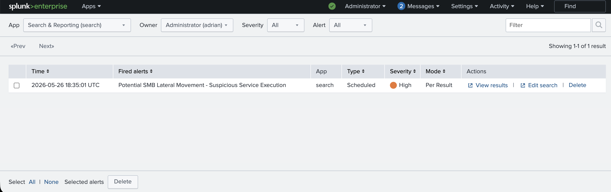

### Step 13 — Detection Investigation and Process Chain Analysis

The triggered event was investigated further inside Splunk to analyze the process execution chain generated during the attack simulation.

Telemetry revealed a **suspicious parent-child process** relationship:

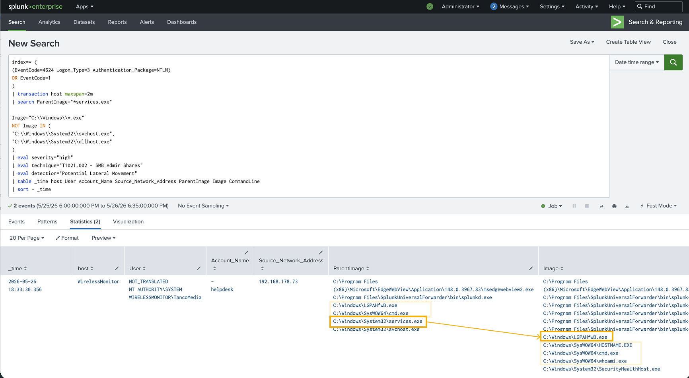

---

**Why This Matters**

**Threat hunting** allows us to proactively identify malicious behavior before automated detections trigger alerts.

These searches simulate real SOC workflows used to investigate:

- Remote execution
- PowerShell abuse
- Administrative misuse
- Ransomware precursor activity
- Lateral movement behavior

---

## Incident Report

A full professional incident report was written documenting this investigation:

[06-Windows-Lateral-Movement-Threat-Detection-Incident-Report.docx](https://docs.google.com/document/d/1upSjokH7R2VhPuXA--MRjiTWu2jdpNYn/edit)

---

## Realistic SOC Detections Demonstrated

This lab **successfully simulated and detected**:

- SMB authentication attacks
- Password spraying behavior
- Remote service execution
- Lateral movement activity
- PowerShell abuse
- Encoded PowerShell execution
- Suspicious parent-child relationships
- Administrative execution chains

---

### Key Detection Concepts Learned

#### 1. Parent-Child Process Analysis

Understanding which process launched another process is critical for:

- Malware analysis
- Threat hunting
- Lateral movement detection

**Examples:**

| Parent Process | Child Process | Meaning |
|---|---|---|
| services.exe | cmd.exe | Remote execution |
| services.exe | powershell.exe | Lateral movement |
| explorer.exe | cmd.exe | User interactive shell |
| winword.exe | powershell.exe | Potential phishing |

**Or, in our case:**

| Parent Process | Child Process | Meaning |
|---|---|---|
| services.exe | random.exe | The random EXE THEN launches cmd/powershell internally. |

---

#### 2. Sysmon Visibility

Sysmon provided significantly better telemetry than default Windows logging, including:

- Full command lines
- Process GUIDs
- Parent process tracking
- Network connections
- Process hashes

---

#### 3. PowerShell Detection Challenges

Observed that:

- Not all remote PowerShell executions generated `Event ID 4104`
- Sysmon `Event ID 1` still provided strong visibility into PowerShell activity

---

## MITRE ATT&CK Mapping

| Technique | Description |
|---|---|
| T1021.002 | SMB/Windows Admin Shares |
| T1059.001 | PowerShell |
| T1059.003 | Windows Command Shell |
| T1078 | Valid Accounts |
| T1021 | Remote Services |
| T1105 | Ingress Tool Transfer |

---

## Skills Demonstrated

- SIEM Engineering
- Splunk Administration
- Windows Event Analysis
- Sysmon Deployment
- Threat Hunting
- Detection Engineering
- PowerShell Detection
- Endpoint Telemetry Analysis
- Windows Security Monitoring
- MITRE ATT&CK Mapping
- Lateral Movement Detection

---

## Challenges Encountered

#### RDP Limitations

The Windows target was Windows Home edition, which does not support inbound RDP hosting.

Adjusted attack simulation to use:

- SMB authentication
- Remote service execution
- CrackMapExec

This still produced highly realistic attacker telemetry.

---

#### Network Troubleshooting

Resolved:

- Bridged adapter networking issues
- VM-to-host communication problems
- Windows firewall filtering
- SMB connectivity validation

---

## Lessons Learned

#### Importance of Endpoint Telemetry

Without Sysmon, many attacker behaviors would have limited visibility.

Sysmon dramatically improved:

- Process visibility
- Command-line auditing
- Lateral movement detection

---

#### Realistic Detection Engineering

In this lab I have demonstrated that effective SOC monitoring depends on:

- Strong telemetry
- Contextual process analysis
- Parent-child relationships
- Behavioral detections

---

## Future Improvements

Planned future enhancements:

- Add Windows Server domain controller
- Simulate Kerberoasting
- Add Splunk Enterprise Security
- Deploy Sigma rules
- Build correlation searches
- Create detection dashboards
- Simulate ransomware encryption behavior
- Add persistence techniques
- Integrate Atomic Red Team testing

---

## Conclusion

This project demonstrates practical SOC analyst and detection engineering capabilities through realistic attacker simulation and telemetry analysis.

The lab successfully reproduced:

- SMB authentication attacks
- Lateral movement behavior
- Remote execution artifacts
- PowerShell abuse
- Threat hunting workflows

using Splunk and Sysmon in a Windows environment.

This project strengthened my hands-on experience with:

- SIEM operations
- Endpoint monitoring
- Detection engineering
- Threat hunting
- Windows security telemetry
- SOC workflows

---
