# Entra ID Brute Force Detection and Response with Microsoft Defender XDR

## 📌 Project Overview

This project demonstrates the detection, investigation, and response to a simulated Entra ID password spray (brute force) attack using Microsoft Defender XDR and Microsoft Sentinel.

The objective was to emulate an attacker attempting to gain access to Microsoft 365 accounts using password spraying techniques from a Kali Linux system and then detect, investigate, correlate, and remediate the activity using Microsoft's security stack.

## ⚙️ Technologies Used

- Microsoft Entra ID
- Microsoft Defender XDR
- Microsoft Sentinel
- Microsoft Defender for Identity
- Microsoft 365
- Kali Linux
- KQL (Kusto Query Language)
- Incident Correlation
- Identity Protection

---

## Attack Scenario

A simulated attacker used Kali Linux to perform password spraying attempts against a Microsoft 365 tenant.

The attack generated multiple failed authentication events which were collected and analyzed through Microsoft Defender XDR and Microsoft Sentinel.

Custom detection rules were configured to identify password spray behavior and automatically generate alerts for investigation.

---

# Phase 1 – Attack Simulation

## Step 1: Execute Password Spray Activity

A password spraying attack was launched from Kali Linux against Entra ID accounts to generate authentication failures and security telemetry.

### Screenshot

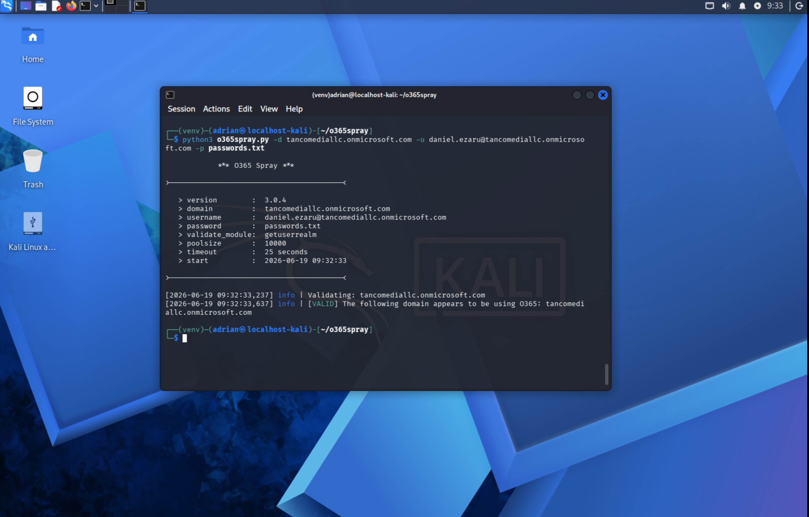

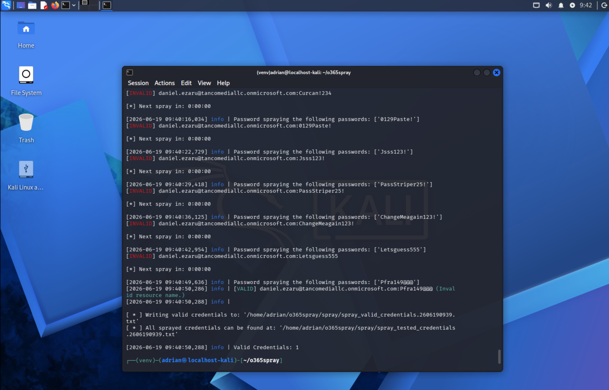

---

## Step 2: Validate Attack Activity

Authentication activity was validated to confirm that failed sign-in events were being generated and forwarded to Microsoft security platforms.

### Screenshot

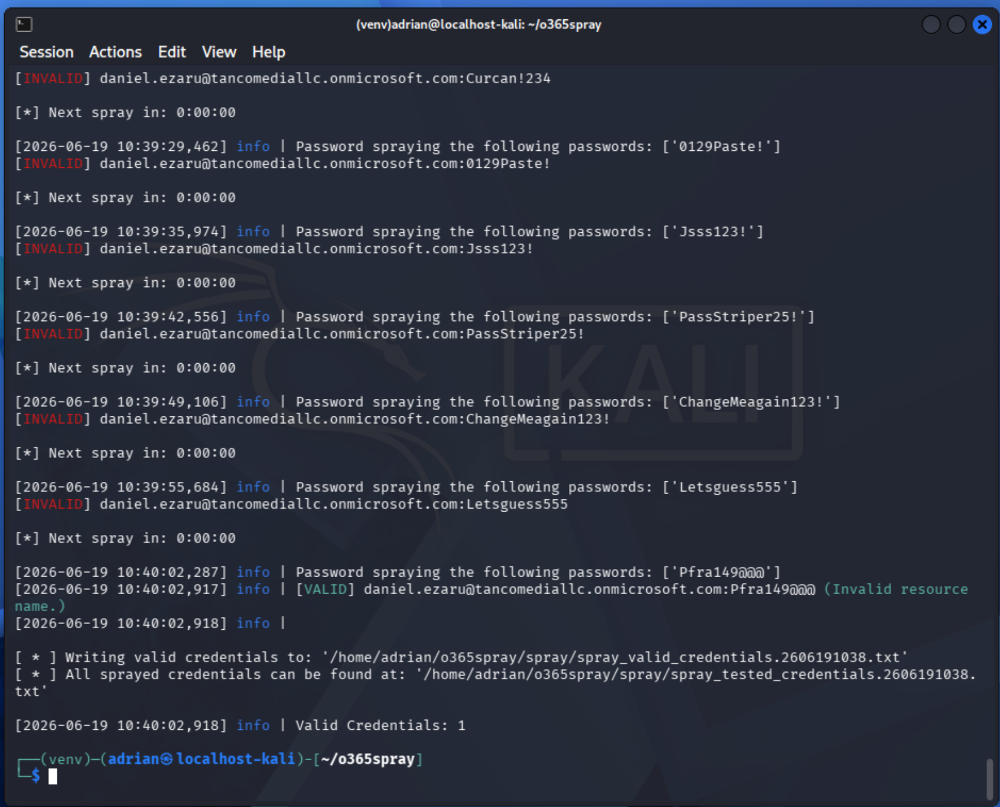

---

# Phase 2 – Detection Engineering

## Step 3: Create Custom Detection Rule

A custom Defender XDR detection rule was created to identify password spraying behavior based on multiple failed authentication attempts from a single source.

### Screenshot

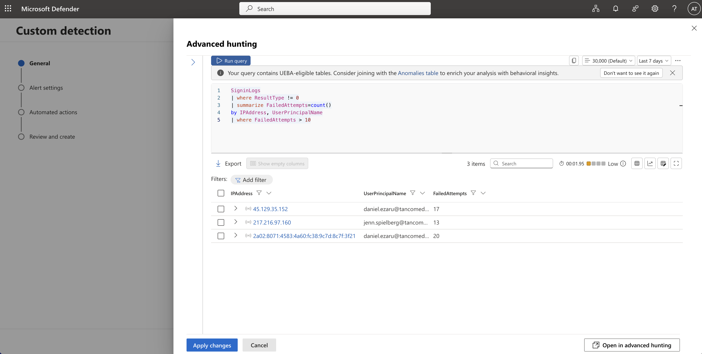

### Screenshot

---

## Step 4: Create Sentinel Detection Query

A custom KQL detection query was created in Microsoft Sentinel to identify authentication anomalies and correlate failed sign-in activity.

### Screenshot

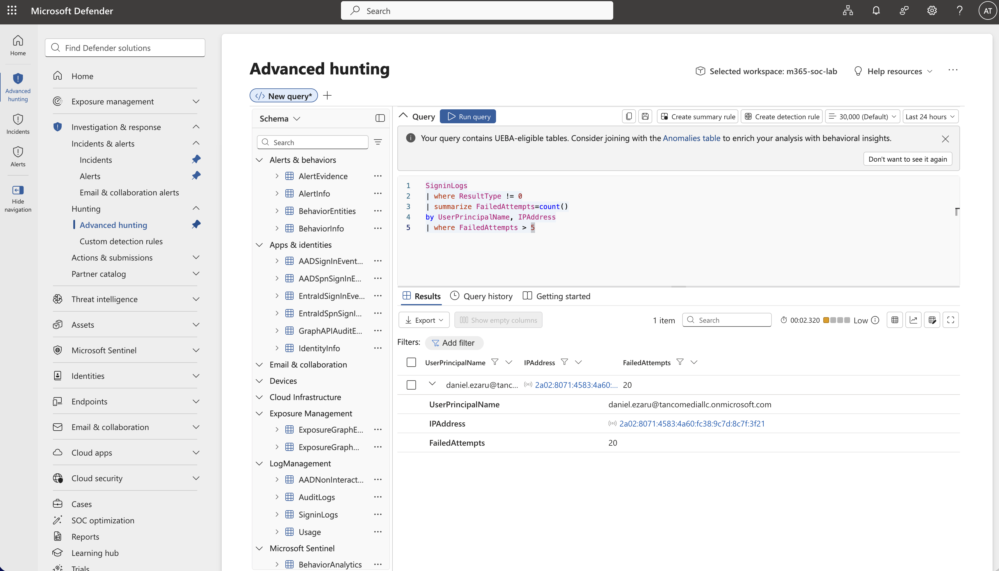

---

# Phase 3 – Alert Generation

## Step 5: Generate Security Alerts

Once attack activity was detected, Microsoft Defender XDR generated security alerts indicating suspicious authentication behavior.

### Screenshot

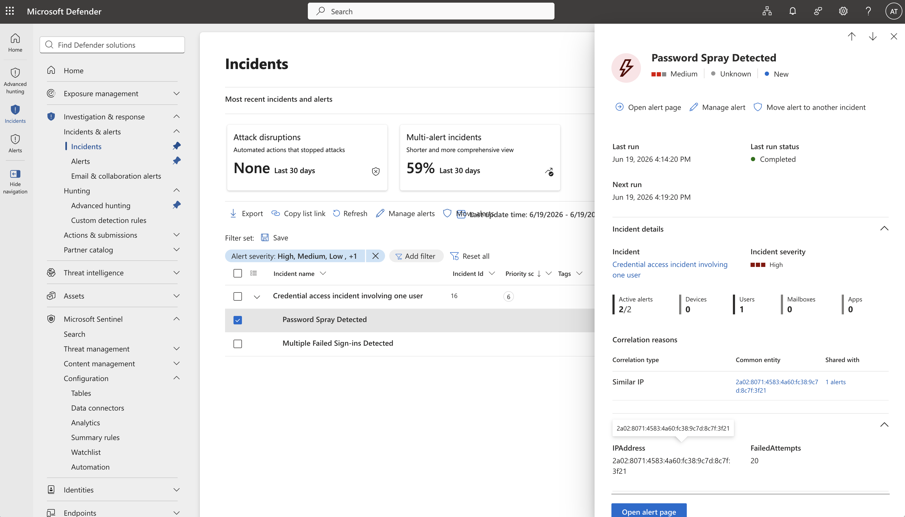

### Screenshot

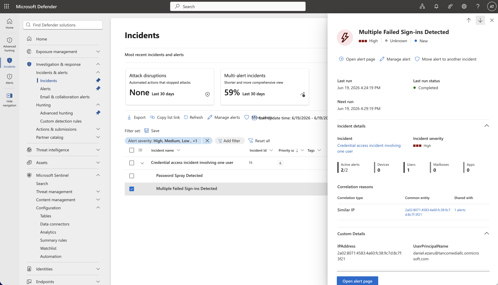

---

## Step 6: Correlate Authentication Events

Authentication logs were correlated to identify attack patterns and determine affected user accounts.

### Screenshot

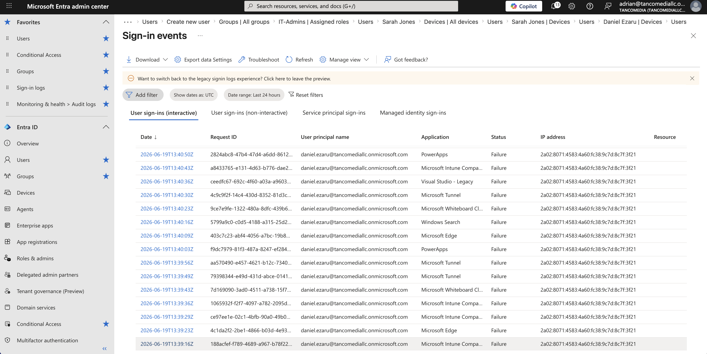

### Screenshot

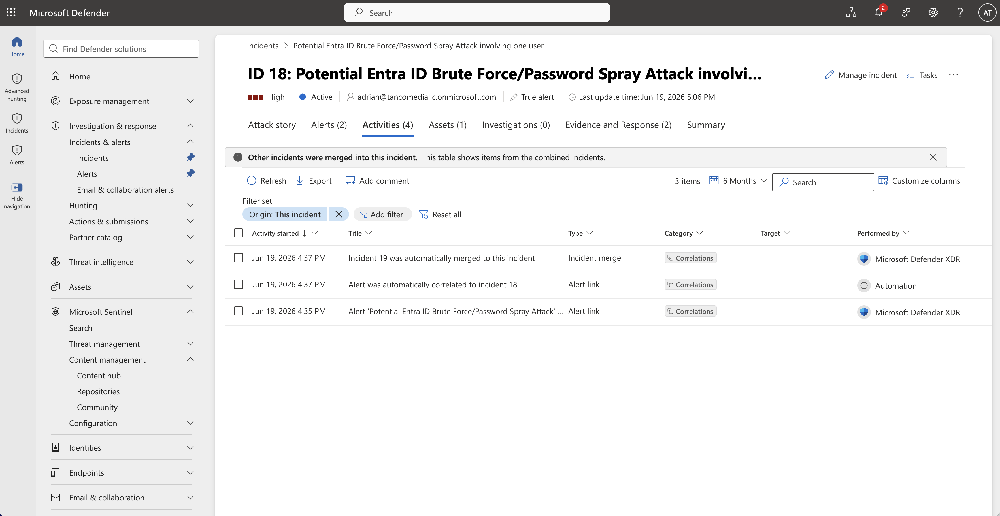

---

# Phase 4 – Incident Investigation

## Step 7: Create Incident

The generated alerts were automatically grouped into a security incident for investigation and response.

### Screenshot

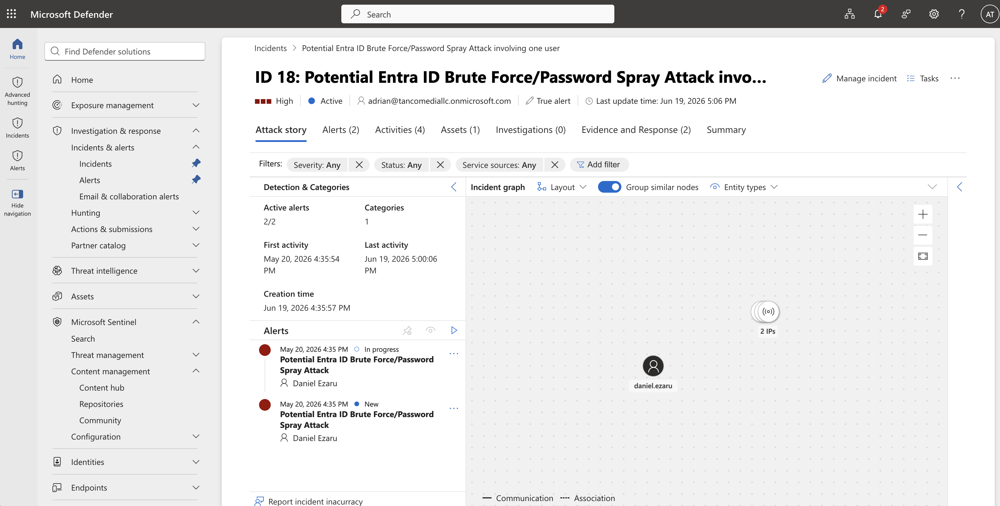

---

## Step 8: Review Incident Summary

Incident data was reviewed to determine the scope of the attack, affected identities, and source indicators.

### Screenshot

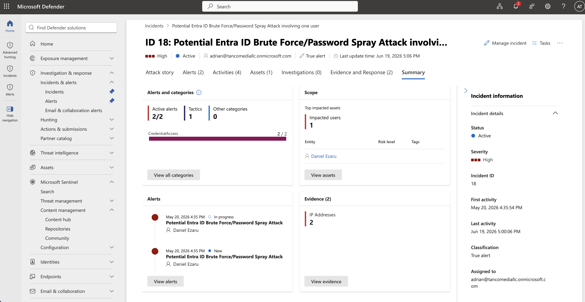

---

## Step 9: Investigate User Activity

User activity was analyzed through Microsoft Defender XDR to determine whether any successful compromise occurred.

### Screenshot

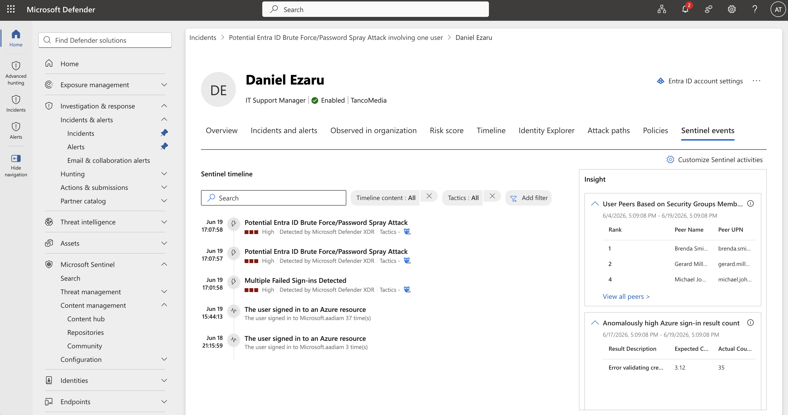

---

# Phase 5 – Response and Remediation

## Step 10: Perform Remediation Actions

Response actions were executed to contain the threat and reduce the likelihood of further compromise.

Examples included:

- Investigating affected accounts
- Reviewing sign-in activity
- Resetting passwords
- Validating MFA configuration
- Monitoring for continued attack attempts

### Screenshot

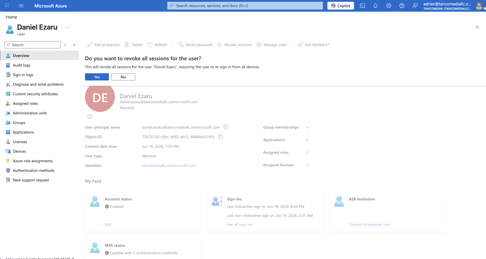

---

# Security Outcomes

This project demonstrates practical experience with:

- Entra ID Identity Monitoring
- Password Spray Detection
- Brute Force Attack Analysis
- Microsoft Defender XDR
- Microsoft Sentinel
- KQL Query Development
- Alert Triage
- Incident Investigation
- Threat Hunting
- Incident Response
- Identity Security Operations

---

# Key Skills Demonstrated

- Detection Engineering
- Security Monitoring
- Microsoft Defender XDR
- Microsoft Sentinel
- Entra ID Security
- KQL Query Writing
- Threat Detection
- Incident Correlation
- Identity Protection
- SOC Analyst Workflows
- Incident Response