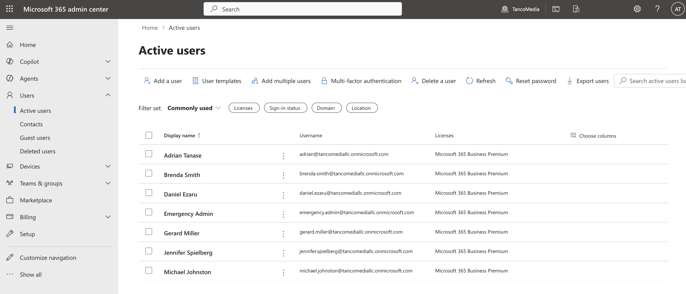
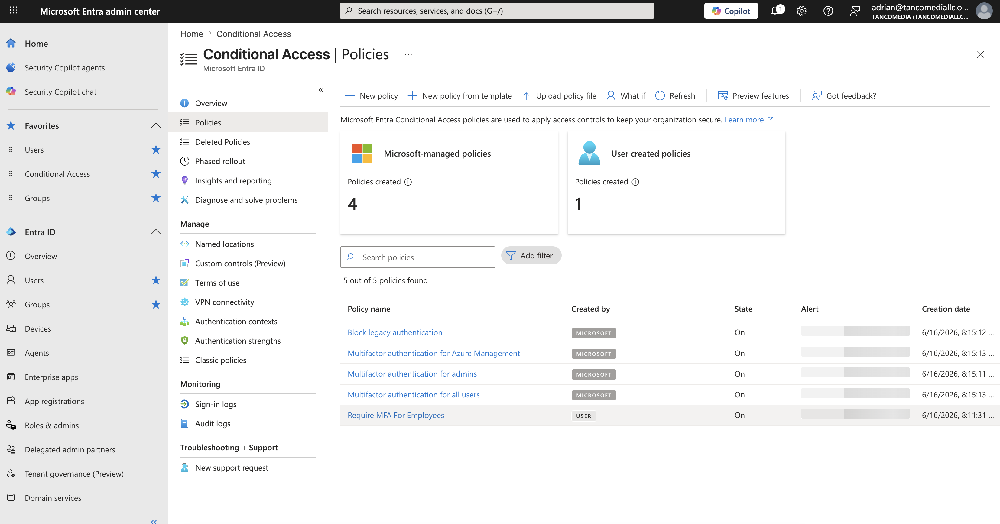
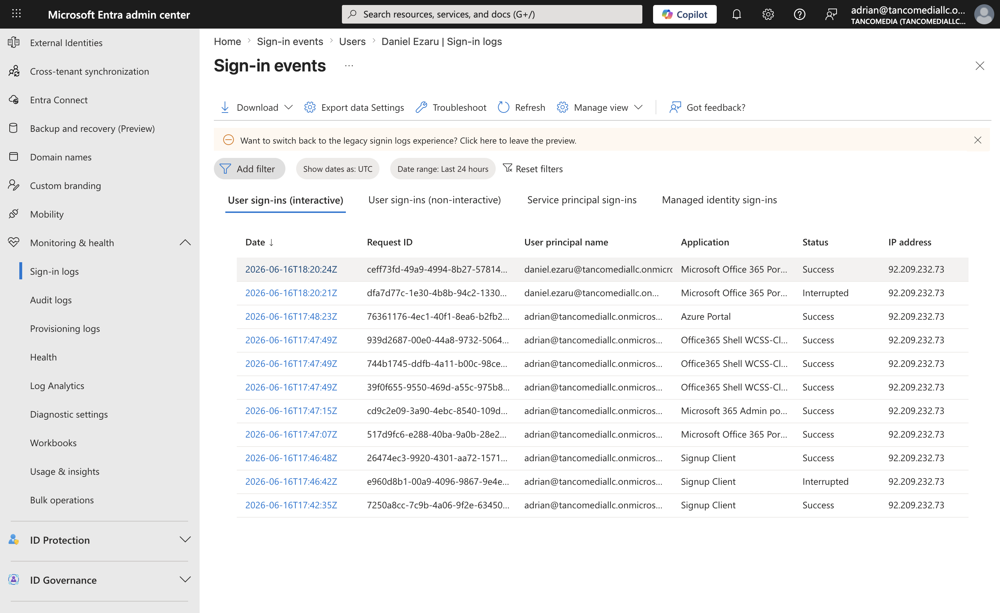
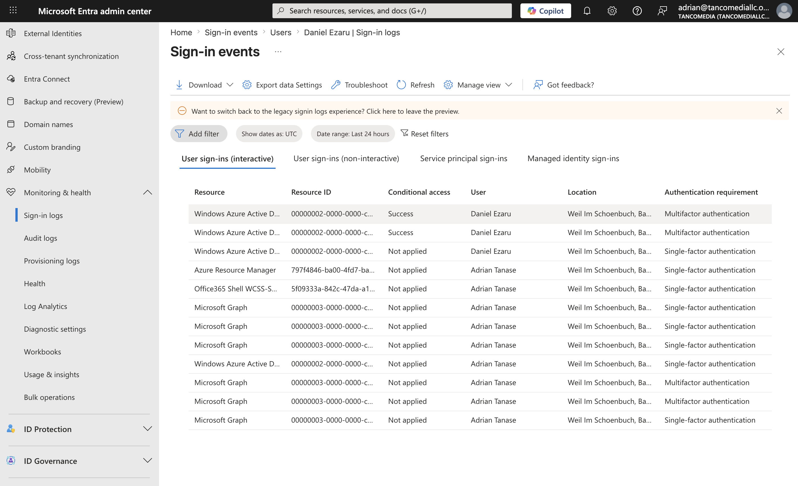

# Phase 1 - Tenant Setup

## Company

TancoMedia

## Users Created

| User | Department | Role |
|--------|------------|--------|
| Brenda Smith | IT Support | IT Support Engineer |
| Daniel Ezaru | IT Support | IT Support Manager |
| Gerard Miller | HR | HR Manager |
| Jennifer Spielberg | HR | HR Talent Recruiter |
| Michael Johnston | Finance | Financial Analyst |

## Security Groups

| Group |
|--------|
| IT Support |
| HR |
| Finance |
| MFA Required |

## Validation

- Users successfully created
- Security groups created
- Members assigned
- Microsoft 365 licensing verified

# Phase 2 - Multi-Factor Authentication

## Objective

Protect user accounts using Conditional Access and MFA.

## Policy Created

Require MFA For Employees

## Scope

Users in MFA Required group

## Exclusions

Emergency Admin

## Authentication Method

Microsoft Authenticator

## Validation

- MFA enrollment completed
- MFA challenge successful
- Conditional Access policy applied
- Sign-in logs verified

## Security Benefit

MFA protects accounts from password theft, credential stuffing, and password spray attacks.

# Phase 3 - Conditional Access Hardening

## Objective

Strengthen identity security using Microsoft Entra Conditional Access.

## Policies Implemented

### Require MFA For Employees

- Targeted MFA Required Group
- Enforced MFA for standard users

### Require MFA For Administrators

- Targeted Global Administrators
- Enforced MFA for privileged accounts

### Block Legacy Authentication

- Blocked Exchange ActiveSync
- Blocked legacy authentication protocols

### Require MFA For Finance Users

- Added additional protection for high-value users

## Security Benefits

- Reduced credential theft risk
- Protected privileged accounts
- Eliminated legacy authentication attack paths
- Strengthened identity security posture

## Evidence

- conditional-access-policies.png
- admin-mfa-policy-details.png
- legacy-auth-policy-details.png