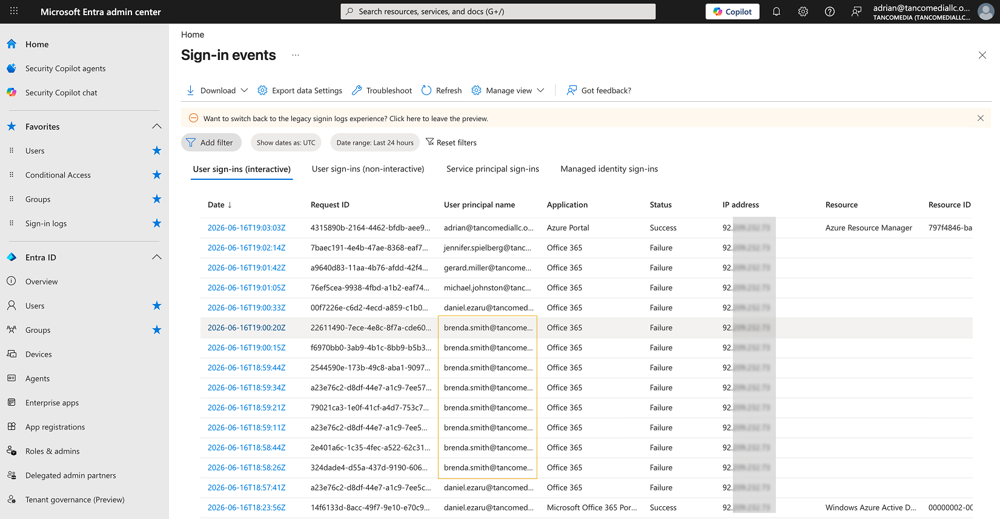
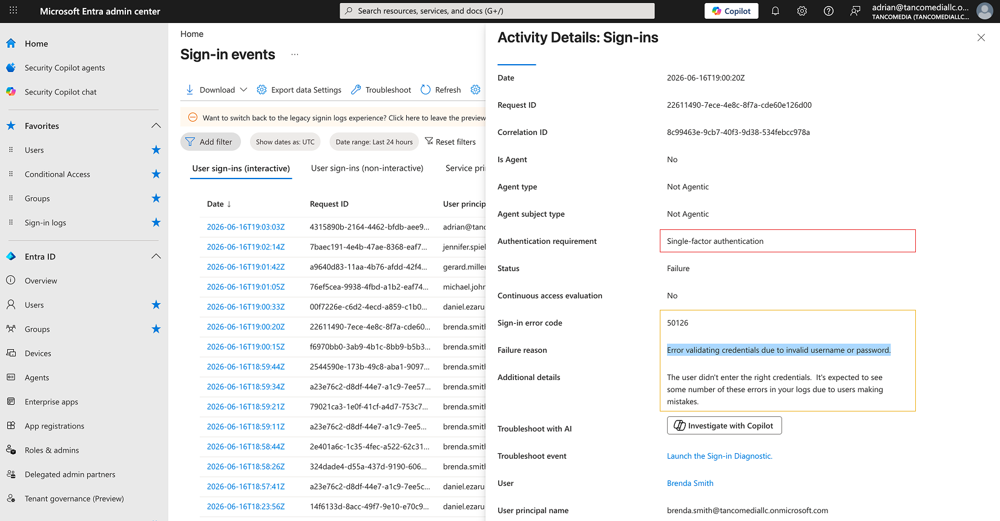
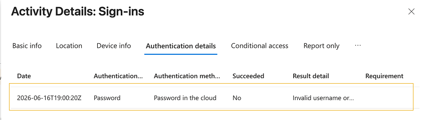

# ⚔️ ENTRA ID Password Spray Attack Detection & Investigation

## 📌 Project Objective

The objective of this phase was to simulate and investigate a password spray attack against a **Microsoft Entra ID environment**.

Password spraying is a common identity-based attack technique where an attacker attempts a small number of commonly used passwords across multiple user accounts. This method helps attackers avoid account lockouts while increasing the likelihood of finding weak credentials.

This exercise demonstrates the ability to:

- Detect suspicious authentication activity
- Investigate Microsoft Entra sign-in logs
- Identify attack indicators
- Assess organizational impact
- Document findings using SOC investigation procedures

---

# Attack Scenario

A simulated password spray attack was conducted against multiple user accounts within the **TancoMedia Microsoft 365 environment**.

The attack generated **authentication failures** across several users to create realistic log activity for analysis and investigation.

---

## Detection Source

`Microsoft Entra ID Sign-In Logs`

## ⚔️ Alert Type

**Password Spray Attempt**

## Targeted Users

```
Brenda Smith
Daniel Ezaru
Gerard Miller
Jennifer Spielberg
```

---

## Initial Evidence

The Microsoft Entra sign-in logs revealed **multiple failed authentication attempts** occurring within a short timeframe against several accounts.

---

# Investigation Process

## Step 1 - Review Authentication Activity

Authentication logs were reviewed to identify unusual sign-in patterns and determine whether multiple users were being targeted simultaneously.



### Analysis Focus

- Failed authentication attempts
- Authentication timestamps
- Source IP addresses
- User account activity
- Conditional Access results

---

## Step 2 - Identify Attack Indicators

Several indicators consistent with password spraying activity were identified.



### Indicators Observed

- Multiple failed sign-in attempts
- Multiple user accounts targeted
- Common attack timeframe
- Repeated authentication failures
- Single source IP address
- No legitimate user activity associated with attempts

These indicators align with known password spray attack behavior commonly observed in cloud identity environments.

---

## Step 3 - Validate Authentication Results

Authentication events were reviewed to determine whether any account compromise occurred.



### Findings

✔️ No successful authentications observed
✔️ No MFA challenges completed
✔️ No privilege escalation activity detected
✔️ No suspicious administrative actions observed
✔️ No evidence of account takeover

---

# Investigation Findings

The investigation determined that the activity was consistent with **a password spray attack targeting multiple user accounts**.

The attacker attempted to authenticate against several accounts using **invalid credentials**.

Microsoft Entra ID successfully recorded and logged all authentication failures, providing visibility into the attack pattern.

---

## Root Cause Analysis

The attack relied on password-based authentication attempts against multiple user accounts.

However, security controls implemented during earlier phases significantly reduced risk:

✔️ Multi-Factor Authentication (MFA)
✔️ Conditional Access Policies
✔️ Administrative MFA Enforcement
✔️ Identity Monitoring

These controls prevented the attack from resulting in account compromise.

---

# Impact Assessment

## Business Impact

✅ No impact identified.

## Data Exposure

✅ No evidence of unauthorized access.

## Account Compromise

✅ No accounts were compromised.

## Service Availability

✅ No disruption to services.

---

# Security Controls That Prevented Compromise

### Multi-Factor Authentication

MFA prevented attackers from accessing accounts even if valid credentials had been obtained.

### Conditional Access Policies

Conditional Access provided additional identity protection and authentication controls.

### Authentication Monitoring

Microsoft Entra sign-in logs enabled rapid detection and investigation of suspicious activity.

---

# Recommendations

### Continue Enforcing MFA

Maintain MFA requirements for all users and privileged accounts.

### Monitor Authentication Failures

Review authentication logs regularly for patterns consistent with password spraying and credential attacks.

### Review Conditional Access Policies

Continue improving identity security controls and access restrictions.

### Implement SIEM Monitoring

Forward Microsoft Entra logs to Microsoft Sentinel for automated detection and alerting.

---

# Skills Demonstrated

- Security Operations Center (SOC)
- Microsoft Entra ID Investigation
- Authentication Log Analysis
- Identity Threat Detection
- Incident Response
- Security Documentation
- Threat Hunting
- Password Spray Detection
- Conditional Access Analysis
- Security Monitoring

---

# Security Incident Report

## Incident Summary

A simulated password spray attack was detected against multiple Microsoft Entra ID user accounts.

Investigation of authentication logs revealed repeated failed sign-in attempts targeting several users from a common source.

No successful authentications occurred, and no accounts were compromised.

---

## Incident Information

| Field | Value |
|---------|---------|
| Date | 2026-06-16 |
| Severity | Medium |
| Status | Closed |
| Detection Method | Microsoft Entra Sign-In Logs |

---

## Affected Accounts

```
Brenda Smith
Daniel Ezaru
Gerard Miller
Jennifer Spielberg
Michael Johnston
```

---

## Investigation Results

The investigation confirmed multiple failed authentication attempts consistent with password spray activity.

✅ **No successful login attempts were identified.**

Conditional Access policies and MFA protections remained effective throughout the attack simulation.

---

## Remediation

✅ **No remediation actions were required due to the absence of successful authentication attempts.**

Existing security controls functioned as expected.

Recommendations were documented for continued monitoring and future Microsoft Sentinel integration.

---

## Lessons Learned

This investigation demonstrated the importance of identity monitoring, authentication logging, and Multi-Factor Authentication in defending against password-based attacks.

The exercise also highlighted how Microsoft Entra ID provides visibility into authentication activity, enabling rapid detection and response by security analysts.
