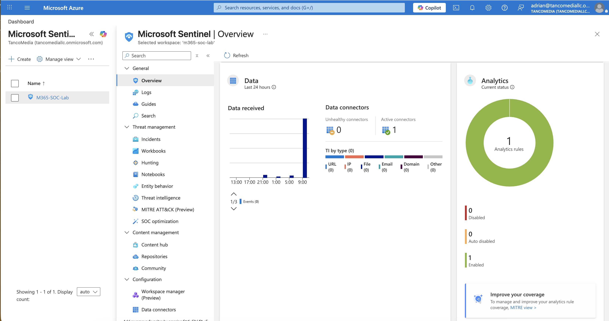
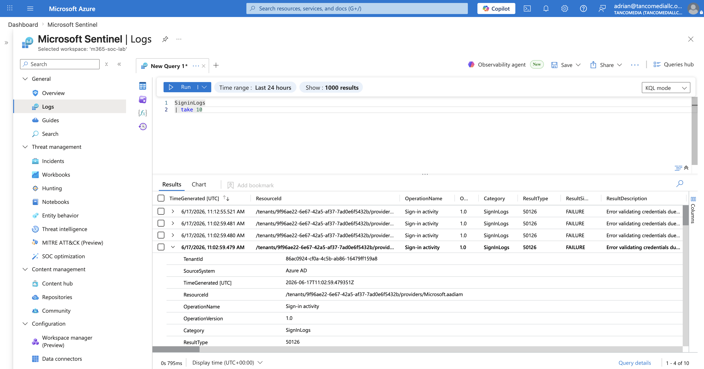
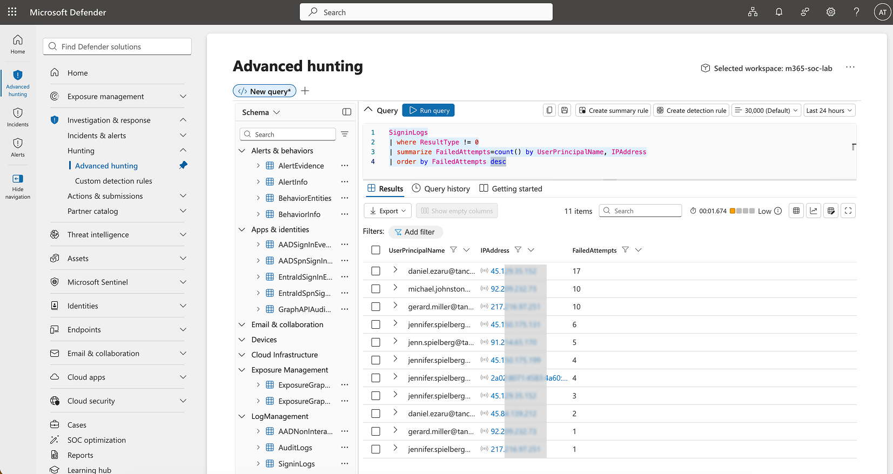
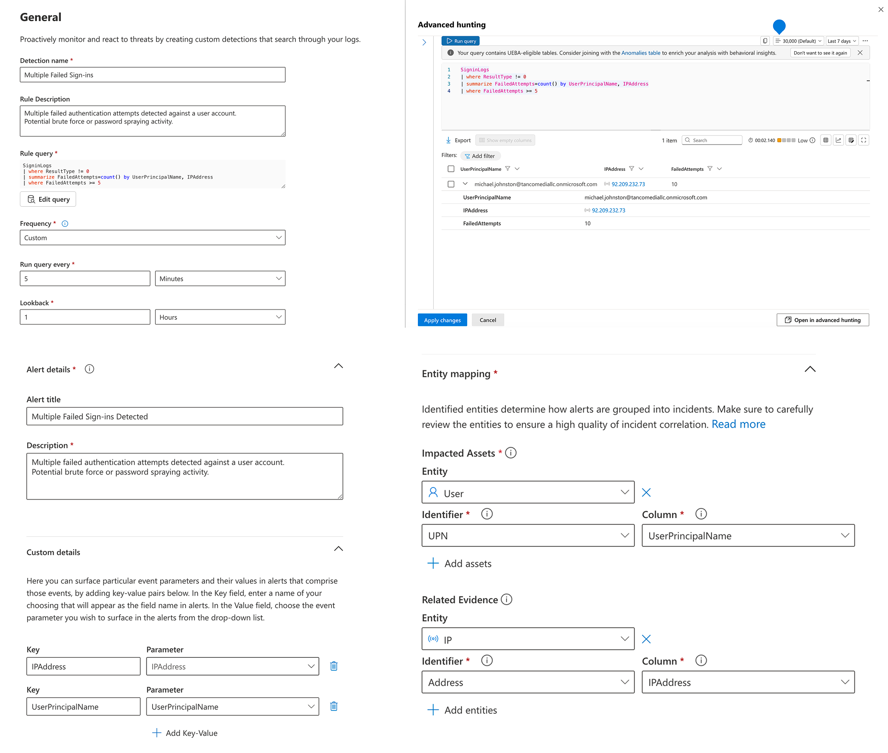
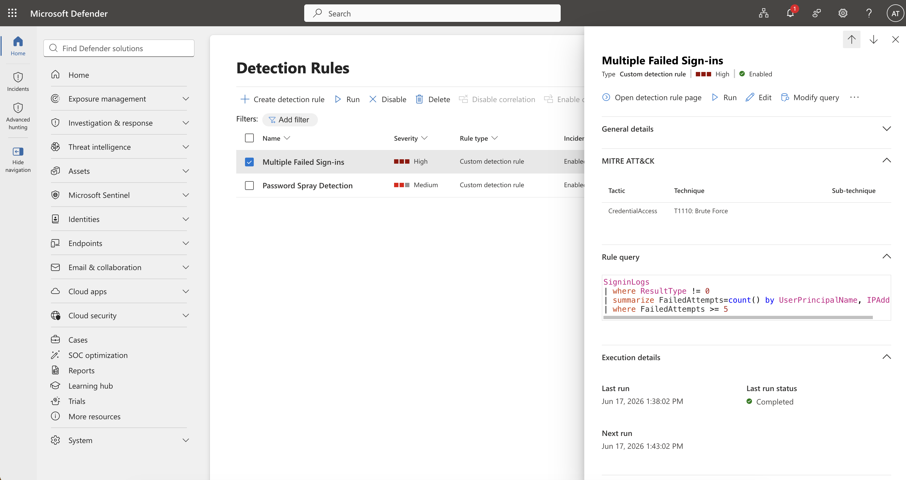
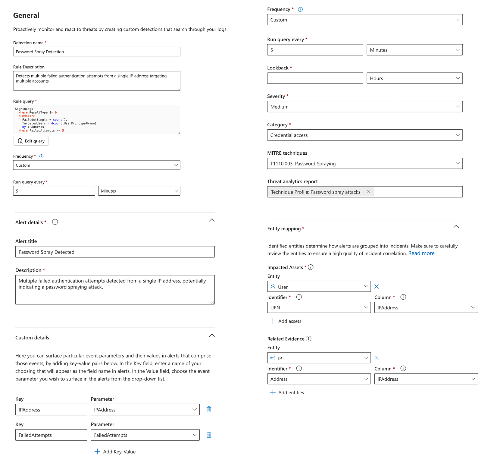
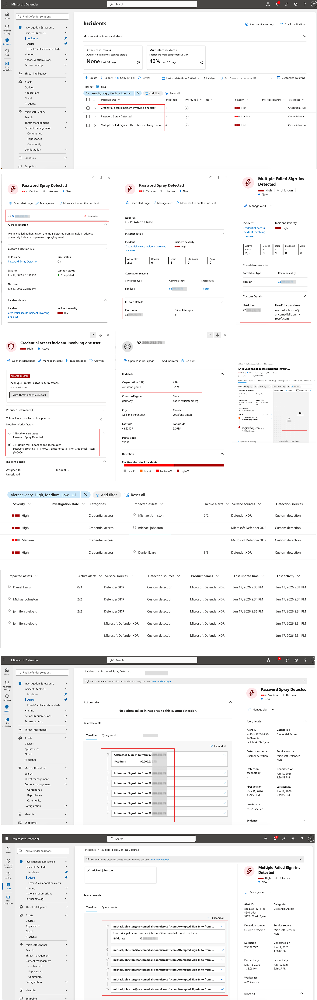

# 🔎 Microsoft Sentinel & Microsoft Defender XDR Threat Hunting

## Objective
Deploy **Microsoft Sentinel**, validate log ingestion, perform threat hunting in **Defender XDR**, create custom detection rules, generate incidents, and investigate alerts using the unified Microsoft security stack.

---

## 1 Microsoft Sentinel Deployment

Microsoft Sentinel was successfully deployed and connected to the Log Analytics workspace (**m365-soc-lab**).

### Evidence


**Validation**
- Sentinel workspace successfully created.
- Analytics engine enabled.
- Data connector operational.
- Sentinel available for threat management, hunting, workbooks, notebooks, and incident response.

---

## 2 Log Ingestion Validation

After enabling **Microsoft Sentinel**, **Azure AD Sign-in logs** were successfully ingested into the Log Analytics workspace.

### Evidence


**Validation**
- `SigninLogs` table populated.
- Authentication events visible in **Sentinel**.
- Failed sign-in events available for detection engineering and threat hunting.

---

## 3 Defender XDR Threat Hunting

Advanced Hunting was used to identify failed authentication activity across user accounts.

### KQL Query

```kusto
SigninLogs
| where ResultType != 0
| summarize FailedAttempts=count() by UserPrincipalName, IPAddress
| order by FailedAttempts desc
```

### Evidence


**Findings**
- Multiple failed sign-in attempts were identified.
- Several accounts showed repeated authentication failures.
- Source IP addresses were captured for further investigation.
- Activity was used as the basis for custom detections.

---

## 4 Custom Detection Rule – Multiple Failed Sign-ins

A **Defender XDR custom detection rule** was created to identify users experiencing repeated failed authentication attempts.

### Detection Logic

```kusto
SigninLogs
| where ResultType != 0
| summarize FailedAttempts=count() by UserPrincipalName, IPAddress
| where FailedAttempts >= 5
```

### Configuration

- Rule Name: `Multiple Failed Sign-ins`
- Severity: `High`
- Category: `Credential Access`
- MITRE ATT&CK: `T1110 Brute Force`
- Frequency: `Every 5 minutes`
- Lookback Period: `1 hour`

### Evidence

#### Rule Configuration


#### Detection Rule Status


**Outcome**
✅ Alerts generated successfully.
✅ User entities mapped using `UserPrincipalName`.
✅ Related IP evidence attached to incidents.
✅ Incidents automatically grouped by affected account.

---

## 5 Custom Detection Rule – Password Spray Detection

A second detection rule was created to identify password spraying behavior originating from a single IP address targeting multiple accounts.

### Detection Logic

```kusto
SigninLogs
| where ResultType != 0
| summarize
    FailedAttempts = count(),
    TargetedUsers = dcount(UserPrincipalName)
    by IPAddress
| where FailedAttempts >= 5
```

### Configuration

- Rule Name: `Password Spray Detection`
- Severity: `Medium`
- Category: `Credential Access`
- MITRE ATT&CK: `T1110.003 Password Spraying`
- Frequency: `Every 5 minutes`
- Lookback Period: `1 hour`

### Evidence


**Outcome**
✅ Password spraying activity successfully detected.
✅ Source IP surfaced as investigation evidence.
✅ Failed attempt counts exposed through custom details.
✅ Alerts mapped to `ATT&CK` credential access techniques.

---

## 6 Incident Generation & Investigation

Custom detections successfully generated incidents within **Defender XDR**.

### Evidence


### Investigation Activities

The following actions were performed:

1. Reviewed generated incidents.
2. Examined alert timelines.
3. Investigated impacted user accounts.
4. Identified source IP addresses.
5. Correlated repeated authentication failures.
6. Reviewed custom detection evidence.
7. Validated MITRE ATT&CK mapping.
8. Confirmed incident enrichment and entity correlation.

### Sample Findings

- Multiple failed sign-in attempts detected against individual users.
- Password spraying behavior identified from a common source IP.
- Defender XDR automatically linked alerts into incidents.
- User and IP entities were available for investigation pivots.
- Incident timelines provided complete authentication event history.

---

## 7 Outcomes

### Completed Objectives

✅ Microsoft Sentinel deployed successfully

✅ Azure AD Sign-in logs ingested

✅ Defender XDR Advanced Hunting operational

✅ Threat hunting performed using KQL

✅ Multiple Failed Sign-ins detection implemented

✅ Password Spray detection implemented

✅ Automated alert generation validated

✅ Incident creation validated

✅ MITRE ATT&CK mappings configured

✅ Investigation workflow completed

---

## Conclusion

We successfully demonstrated end-to-end detection engineering and incident response capabilities using Microsoft Sentinel and Microsoft Defender XDR. Log ingestion, threat hunting, custom detections, alert generation, incident correlation, and investigation workflows were validated, providing operational security monitoring coverage for credential access threats including brute force and password spraying attacks.
