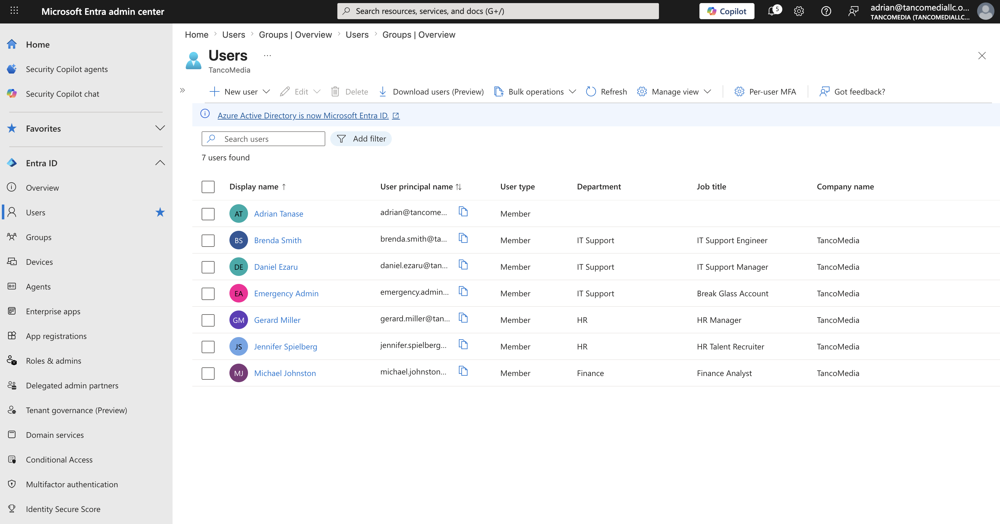
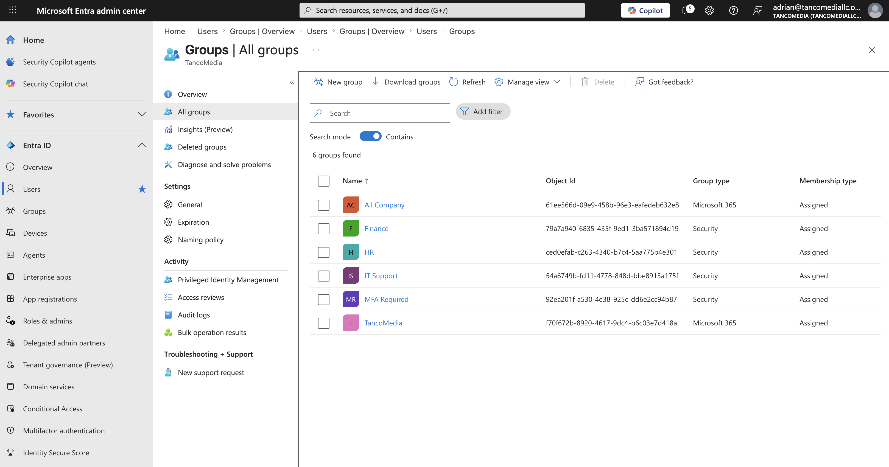
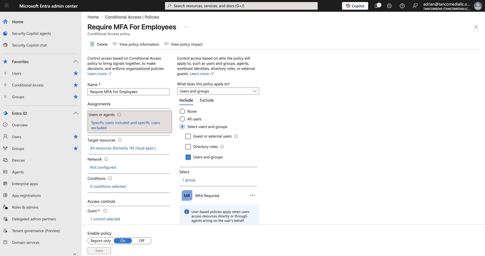
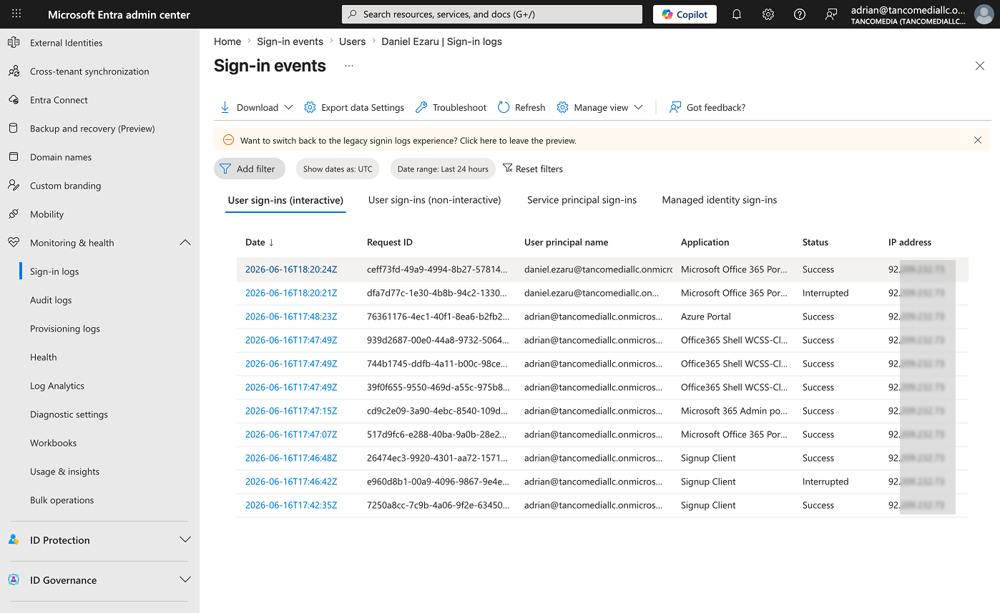
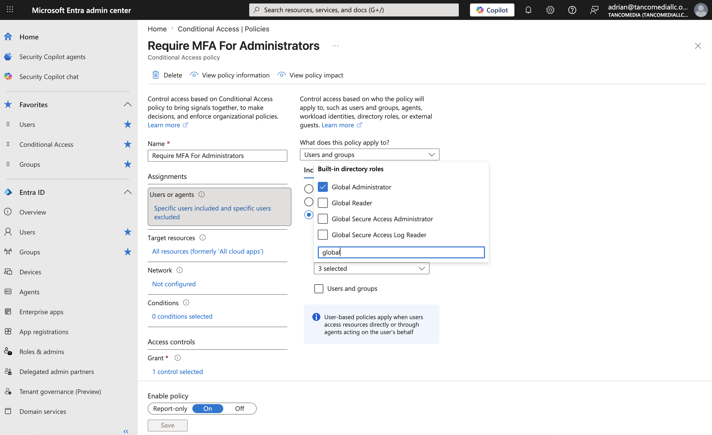
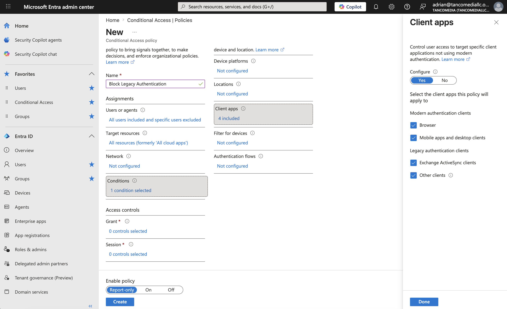
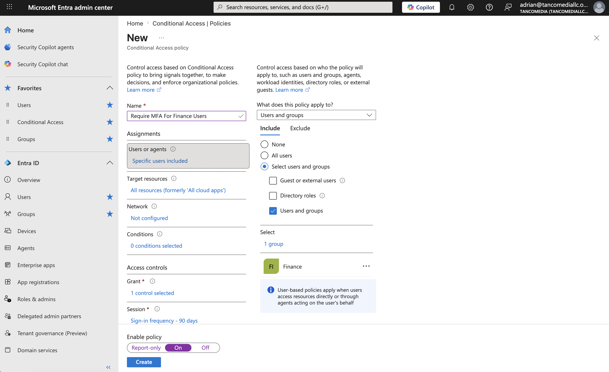
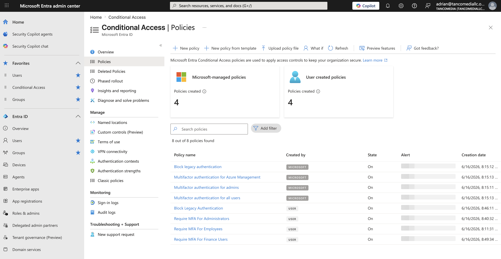

# Microsoft 365 + Entra ID Security Operations Lab


[](#)
[](#)

## Project Overview

This project simulates a real-world Microsoft 365 and Microsoft Entra ID environment used by a small organization. The objective is to implement identity security controls, monitor authentication activity, investigate suspicious behavior, and demonstrate hands-on experience with Microsoft cloud security technologies.

The lab focuses on:

- Microsoft Entra ID administration
- Conditional Access
- Multi-Factor Authentication (`MFA`)
- Identity protection
- Authentication monitoring
- Password spray attack investigation
- Security Operations Center (SOC) workflows
- Microsoft Sentinel integration

---

# Environment Overview

## Organization

**TancoMedia**

### Departments

```
- IT Support
- Human Resources (HR)
- Finance
```

### Security Goals

The environment was designed to:

- Protect user identities
- Enforce Multi-Factor Authentication
- Secure privileged accounts
- Block legacy authentication protocols
- Reduce the risk of password-based attacks
- Improve visibility into authentication activity

---

# Phase 1 - Tenant Setup

## Objective

The first phase focused on creating a realistic Microsoft Entra ID environment that could be used to simulate security operations and identity protection scenarios.

A small business structure was created with multiple departments, users, and security groups. This provides a foundation for implementing role-based security controls later in the project.

---

## Company

`TancoMedia`

---

## Users Created

| User | Department | Role |
|--------|------------|--------|
| **Brenda Smith** | IT Support | IT Support Engineer |
| **Daniel Ezaru** | IT Support | IT Support Manager |
| **Gerard Miller** | HR | HR Manager |
| **Jennifer Spielberg** | HR | HR Talent Recruiter |
| **Michael Johnston** | Finance | Financial Analyst |



### Why This Matters

Microsoft Entra ID uses user identities as the foundation of access control and security monitoring. Creating realistic user accounts allows security controls, investigations, and authentication monitoring to be tested in a controlled environment.

---

## Security Groups

| Group |
|--------|
| IT Support |
| HR |
| Finance |
| MFA Required |



### Why This Matters

Security groups simplify administration and allow Conditional Access policies to be applied at scale. Instead of targeting individual users, security controls can be assigned to entire departments or security groups.

---

## Licensing Validation

Microsoft 365 Business Premium licensing was assigned and verified to **enable advanced security capabilities** such as **Conditional Access and Microsoft Defender**.


### Validation

✅ Users successfully created<br>
✅ Security groups created<br>
✅ Members assigned<br>
✅ Microsoft 365 licensing verified

---

# Phase 2 - Multi-Factor Authentication

## Objective

Multi-Factor Authentication (`MFA`) was implemented to reduce the risk of unauthorized access resulting from compromised passwords.

`MFA` requires users to provide an additional verification factor beyond their password, significantly improving account security.

---

## Policy Created

### Require MFA For Employees




### Scope

Users within the **MFA Required** security group.

### Exclusions

Emergency Administrator account.

### Authentication Method

**Microsoft Authenticator**

---

## Validation

Authentication testing confirmed that users were required to complete MFA before gaining access.

✅ MFA enrollment completed<br>
✅ MFA challenge successful<br>
✅ Conditional Access policy applied<br>
✅ Sign-in logs verified




---

## Security Benefit

MFA significantly reduces the likelihood of successful attacks involving:

- Password theft
- Credential stuffing
- Password spray attacks
- Phishing-based credential compromise

According to Microsoft, MFA can prevent the vast majority of password-based account compromise attempts.

---

# Phase 3 - Conditional Access Hardening

## Objective

Conditional Access policies were implemented to strengthen identity security and enforce **Zero Trust security principles**.

Conditional Access evaluates authentication requests and determines whether access should be granted, blocked, or require additional verification.

---

## Policies Implemented

### Require MFA For Employees

This policy enforces MFA for standard employee accounts.

**Controls Implemented**

🛡️ Targeted MFA Required security group<br>
🛡️ MFA required during authentication


---

### Require MFA For Administrators

Administrative accounts present a higher security risk because they have elevated privileges.

This policy ensures privileged users are protected with stronger authentication requirements.

**Controls Implemented**

🛡️ Targeted Global Administrator accounts<br>
🛡️ Required MFA before access is granted



---

### Block Legacy Authentication

Legacy authentication protocols do not support modern security controls such as MFA and are frequently targeted by attackers.

**Controls Implemented**

🛡️ Blocked Exchange ActiveSync<br>
🛡️ Blocked legacy authentication protocols<br>
🛡️ Reduced attack surface



---

### Require MFA For Finance Users

Finance users often have access to sensitive business information and are considered high-value targets.

An additional Conditional Access policy was created to provide enhanced protection for finance personnel.

**Controls Implemented**

🛡️ Targeted Finance group<br>
🛡️ Required MFA before access



---

### Policy Overview

The completed Conditional Access policy set provides layered identity protection across the environment.



---

## Security Benefits

The implemented controls provide several security advantages:

### Reduced Credential Theft Risk

👉🏻 Compromised passwords alone are insufficient to access protected resources.

### Protection of Privileged Accounts

👉🏻 Administrative accounts require stronger authentication controls.

### Elimination of Legacy Authentication

👉🏻 Older protocols that bypass MFA protections have been disabled.

### Improved Identity Security Posture

👉🏻 Access decisions are now based on modern identity security principles and risk reduction strategies.

---

## Key Skills Demonstrated

- Microsoft Entra ID Administration
- Microsoft 365 Security Configuration
- Identity and Access Management (IAM)
- Conditional Access
- Multi-Factor Authentication
- Security Group Management
- Authentication Security
- Security Hardening
- SOC Documentation
- Security Operations Fundamentals
