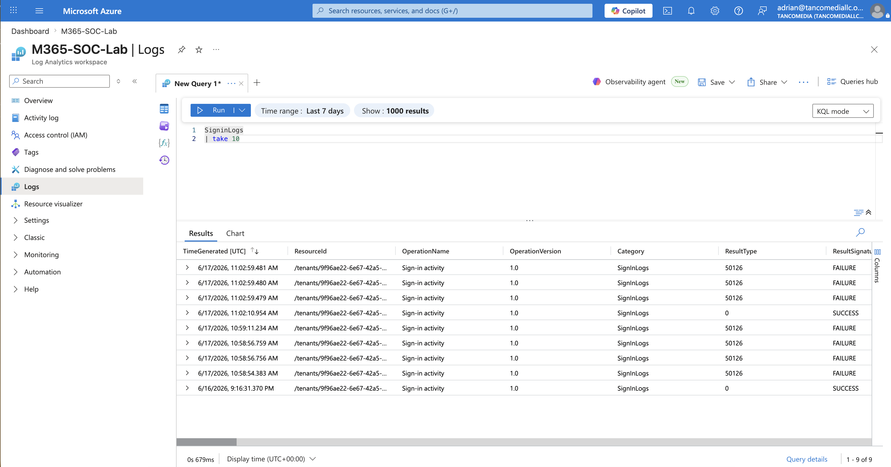
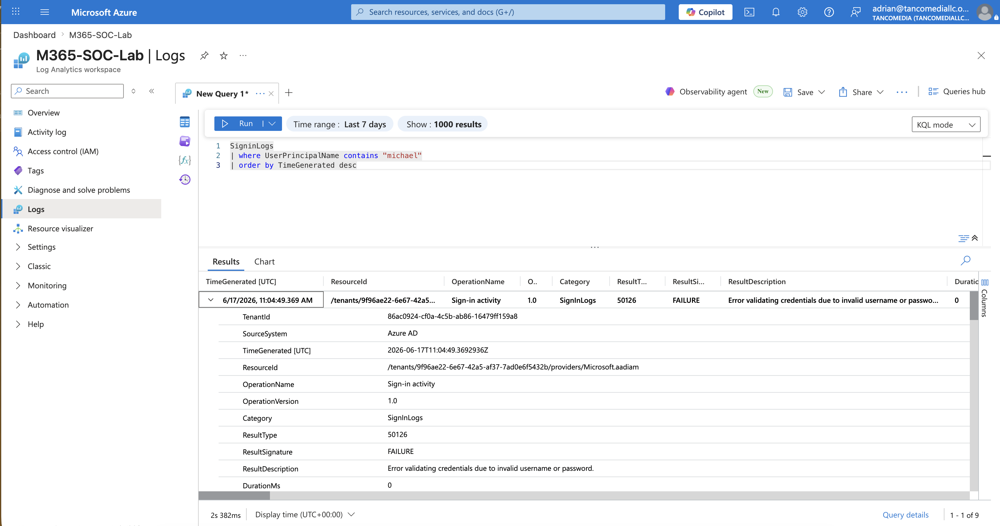
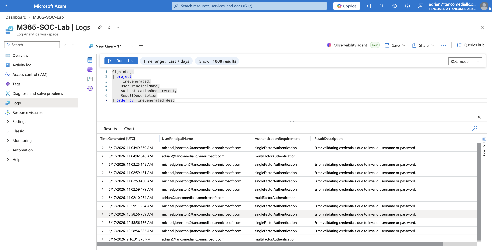
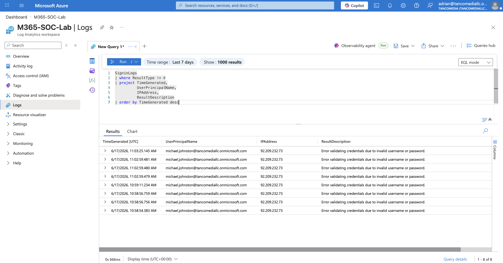
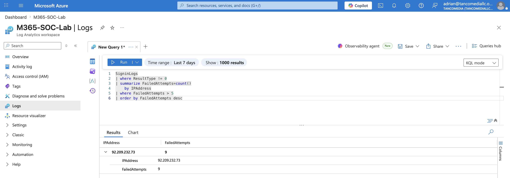

# 🔎 KQL Threat Hunting with Microsoft Entra ID Logs


[](#)
[](#)

## Overview

This project demonstrates threat hunting and security investigation using **Kusto Query Language (KQL)** against Microsoft Entra ID sign-in logs collected in Azure Log Analytics.

The objective was to validate log ingestion, investigate authentication activity, identify failed login attempts, analyze MFA usage, and detect potential password spray behavior.

---

## Environment

| Component | Technology |
|------------|-------------|
| Identity Provider | Microsoft Entra ID |
| SIEM Backend | Azure Log Analytics |
| Security Platform | Microsoft Defender XDR |
| Query Language | Kusto Query Language (KQL) |
| Cloud Platform | Microsoft Azure |

---

# Objectives

- Validate Microsoft Entra ID log ingestion
- Investigate user sign-in activity
- Analyze MFA enforcement
- Detect failed authentication attempts
- Identify password spray indicators
- Prepare for Sentinel analytics rule creation

---

# 1. Validate Log Ingestion

Before beginning threat hunting activities, log ingestion was validated to confirm that Microsoft Entra ID Sign-In Logs were successfully reaching Azure Log Analytics.

### Query

```kql
SigninLogs
| take 10
```

### Purpose

Retrieve recent sign-in events and verify:

- Log collection is operational
- Sign-in records are available
- Data fields are populated correctly

### Result

Successful sign-in and failed sign-in events were visible inside Log Analytics.



---

# 2. User Investigation Query

Investigated sign-in activity for a specific user account.

### Query

```kql
SigninLogs
| where UserPrincipalName contains "michael"
| order by TimeGenerated desc
```

### Purpose

Used during account investigations to:

- Review recent login activity
- Validate authentication attempts
- Identify suspicious access behavior

### Result

Recent sign-in attempts for the selected user were successfully retrieved.



---

# 3. MFA Authentication Analysis

Analyzed authentication methods used during sign-in activity.

### Query

```kql
SigninLogs
| project
    TimeGenerated,
    UserPrincipalName,
    AuthenticationRequirement,
    ResultDescription
| order by TimeGenerated desc
```

### Purpose

Identify:

- MFA-protected logins
- Single-factor authentications
- Authentication trends

### Result

✅ Both Multi-Factor Authentication and Single-Factor Authentication events were observed.



---

# 4. Failed Login Investigation

Focused on failed authentication attempts.

### Query

```kql
SigninLogs
| where ResultType != 0
| project
    TimeGenerated,
    UserPrincipalName,
    IPAddress,
    ResultDescription
| order by TimeGenerated desc
```

### Purpose

Detect:

- Invalid password attempts
- Account enumeration activity
- Early brute-force indicators

### Result

Multiple failed login attempts were identified from the same source IP address.



---

# 5. Password Spray Detection

Aggregated failed authentication attempts by source IP address.

### Query

```kql
SigninLogs
| where ResultType != 0
| summarize FailedAttempts=count()
    by IPAddress
| where FailedAttempts > 5
| order by FailedAttempts desc
```

### Purpose

Detect:

- Password spray attacks
- Brute-force activity
- High-volume authentication failures

### Result

✅ One IP address generated 9 failed login attempts, indicating suspicious authentication activity.



---

# Security Findings

## Observed Events

### Failed Authentication Attempts

- Multiple invalid password attempts detected
- Authentication failures originated from a single IP address

### Authentication Requirements

Observed:

- Single-Factor Authentication
- Multi-Factor Authentication

### Threat Indicators

Potential indicators identified:

- Password Spray Activity
- Brute Force Attempts
- Credential Stuffing Behavior

---

# Microsoft Defender XDR Integration

Microsoft Defender XDR was used alongside Azure Log Analytics to provide:

- Identity visibility
- User sign-in telemetry
- Authentication event correlation
- Threat investigation capabilities

This integration allows analysts to pivot between:

- Microsoft Entra ID
- Microsoft Defender XDR
- Azure Log Analytics
- Microsoft Sentinel

for end-to-end investigation workflows.

---

# Skills Demonstrated

- Kusto Query Language (KQL)
- Microsoft Entra ID Monitoring
- Identity Threat Hunting
- Authentication Analysis
- Azure Log Analytics
- Microsoft Defender XDR
- Security Operations (SOC)
- Incident Investigation

---

# MITRE ATT&CK Mapping

| Technique | ID |
|------------|------|
| Password Spraying | T1110.003 |
| Brute Force | T1110 |
| Credential Access | TA0006 |
| Valid Accounts | T1078 |

---

# Screenshots

| Screenshot | Description |
|------------|-------------|
| log-ingestion-validation.png | Validation of Entra ID log ingestion |
| user-investigation-query.png | User activity investigation |
| mfa-analysis-query.png | MFA authentication analysis |
| failed-login-query.png | Failed login investigation |
| password-spray-query.png | Password spray detection query |

---

# Next Phase

➡️ Microsoft Sentinel Deployment, Defender XDR & Detection Engineering

The next phase expands threat detection capabilities by integrating Microsoft Sentinel, creating custom analytics rules, and generating security incidents from Entra ID authentication events.
