# Active Directory / Microsoft 365 User & Role Management Project

## 📌 Overview

This project demonstrates core Microsoft 365 and Microsoft Entra ID (Azure Active Directory) administration tasks. The objective was to create and manage users, organize them into groups, assign licenses and administrative roles, and validate access permissions through role-based access control (RBAC).

## 🧠 Skills Demonstrated

✅ Microsoft Entra ID Administration 
✅ User Account Management 
✅ Security Group Management 
✅ Role-Based Access Control (RBAC) 
✅ Microsoft 365 License Assignment 
✅ Administrative Role Assignment 
✅ Password Management 
✅ Identity and Access Management (IAM)

---

# Project Walkthrough

## Step 1: Create a New User

A new user account was created within Microsoft Entra ID. During this process, user details such as name, username, and initial sign-in credentials were configured.

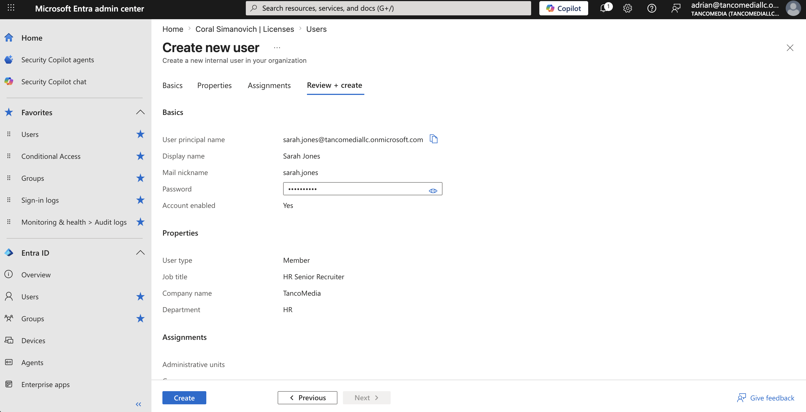

---

## Step 2: Create an HR Security Group

An HR security group was created to logically organize users and simplify permission management. Groups allow administrators to assign permissions and licenses at scale.

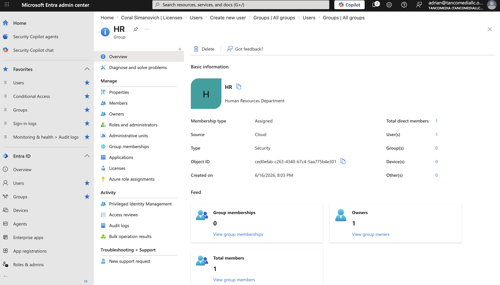

---

## Step 3: Add Users to the HR Group

The newly created user was added to the HR security group. Group membership helps centralize access management and reduces administrative overhead.

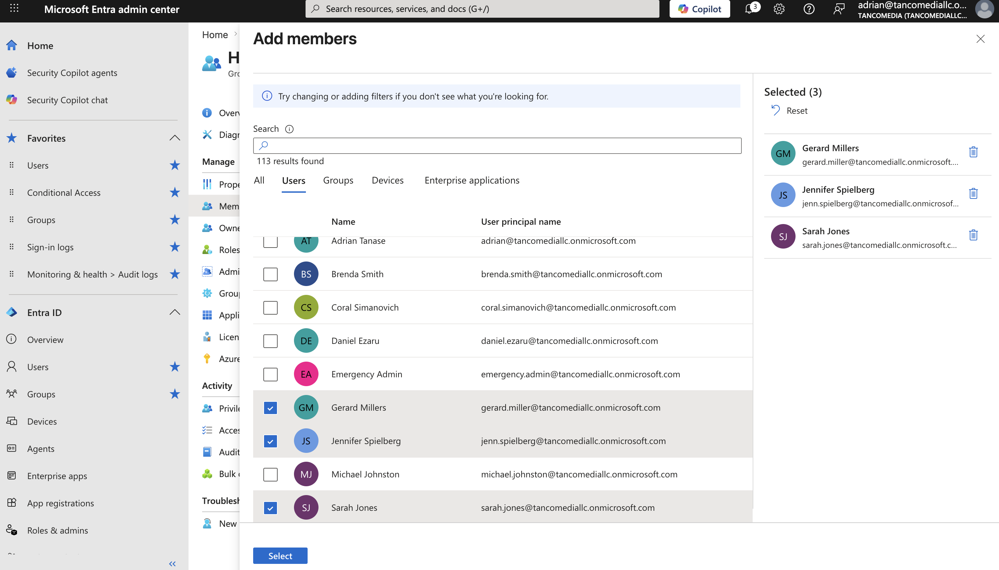

---

## Step 4: Verify Group Membership

The HR group membership was reviewed to confirm that the correct users had been successfully added and that the group structure was configured properly.

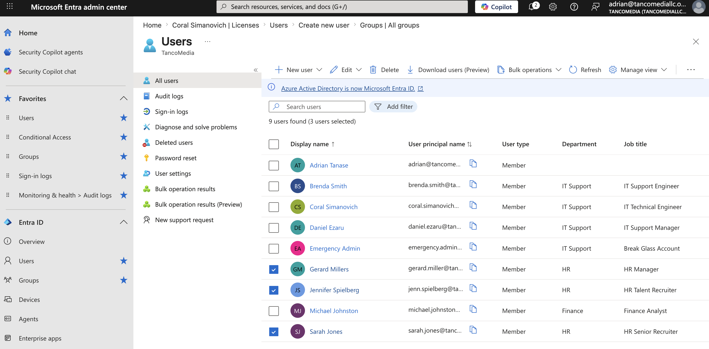

---

## Step 5: Assign Microsoft 365 Licenses

Licenses were assigned to users to enable access to Microsoft 365 services such as Outlook, Teams, OneDrive, and other productivity applications.

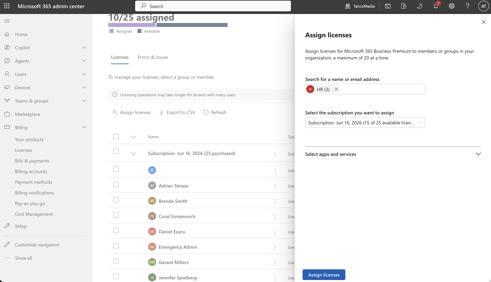

---

## Step 6: Create an Administrative Group

A dedicated administrative group was created to manage elevated permissions more efficiently and support role-based administration.

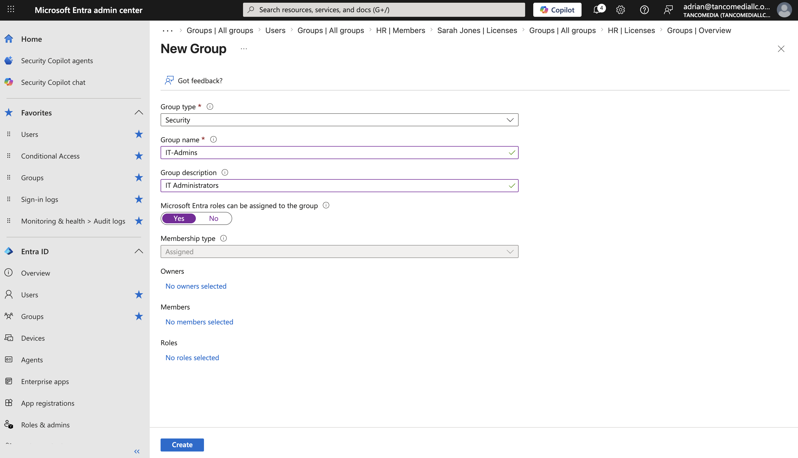

---

## Step 7: Assign Administrative Roles to the Group

Administrative roles were assigned to the group instead of directly to individual users. This follows best practices by simplifying permission management and improving scalability.

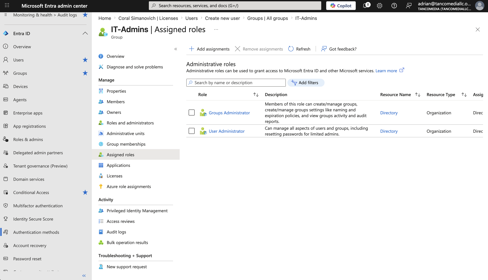

---

## Step 8: Configure Additional Administrative Permissions

A secondary role was assigned to provide additional administrative capabilities required for specific management tasks within the tenant.

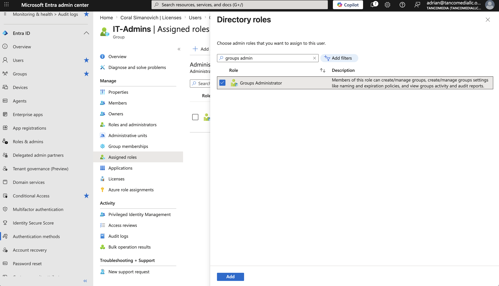

---

## Step 9: Assign an Administrative Role to a User

An administrative role was assigned directly to a user account to grant elevated privileges required for user and identity management tasks.

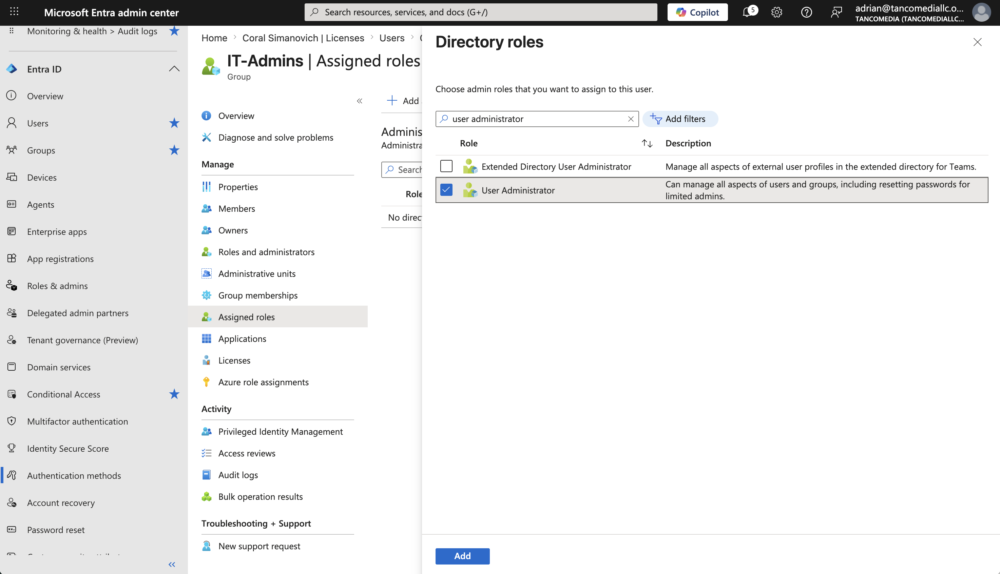

---

## Step 10: Verify Administrative Role Assignment

Role assignments were reviewed and validated to ensure the correct permissions had been successfully applied to the user account.

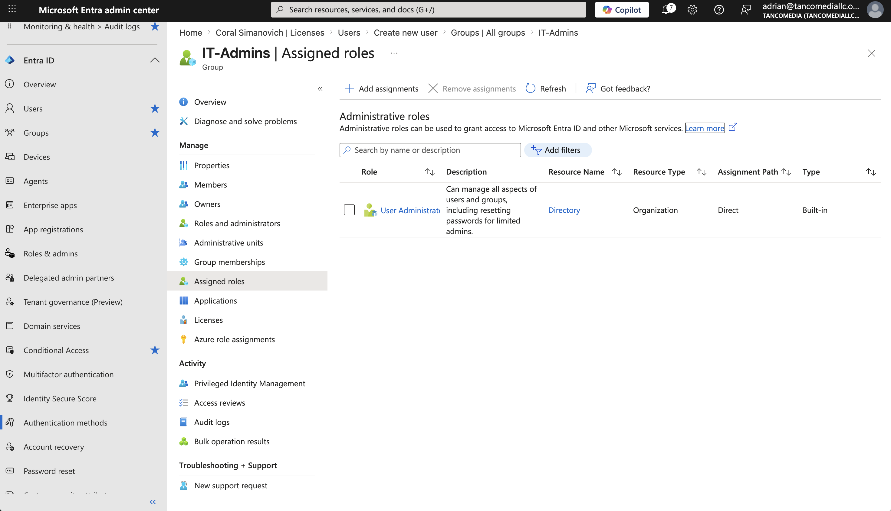

---

## Step 11: Perform a Password Reset

A password reset operation was completed to verify administrative access and demonstrate account recovery procedures within Microsoft Entra ID.

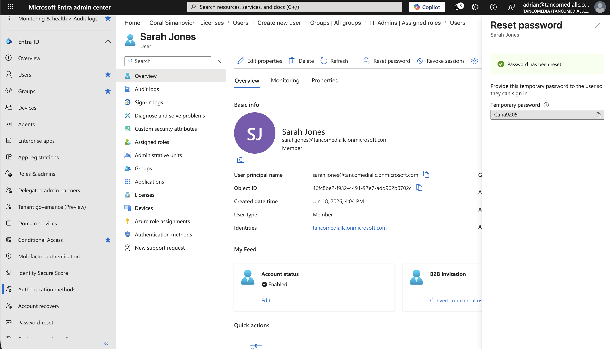

---

# Key Learning Outcomes

Through this project, I gained practical experience in:

- Managing user identities in Microsoft Entra ID
- Creating and managing security groups
- Implementing Role-Based Access Control (RBAC)
- Assigning Microsoft 365 licenses
- Managing administrative permissions
- Following identity and access management best practices
- Performing password reset and account recovery operations

---

# Technologies Used

- Microsoft Entra ID (Azure Active Directory)
- Microsoft 365 Admin Center
- Identity and Access Management (IAM)
- Role-Based Access Control (RBAC)

---

# Project Outcome

Successfully created and managed users, groups, licenses, and administrative roles while implementing secure identity management practices within a Microsoft 365 environment. The project demonstrates foundational skills required for Microsoft 365 Administration, Help Desk, Systems Administration, and Identity & Access Management roles.