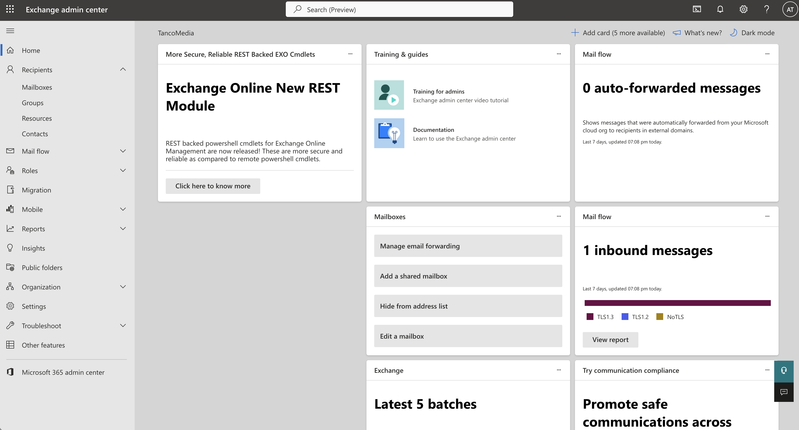
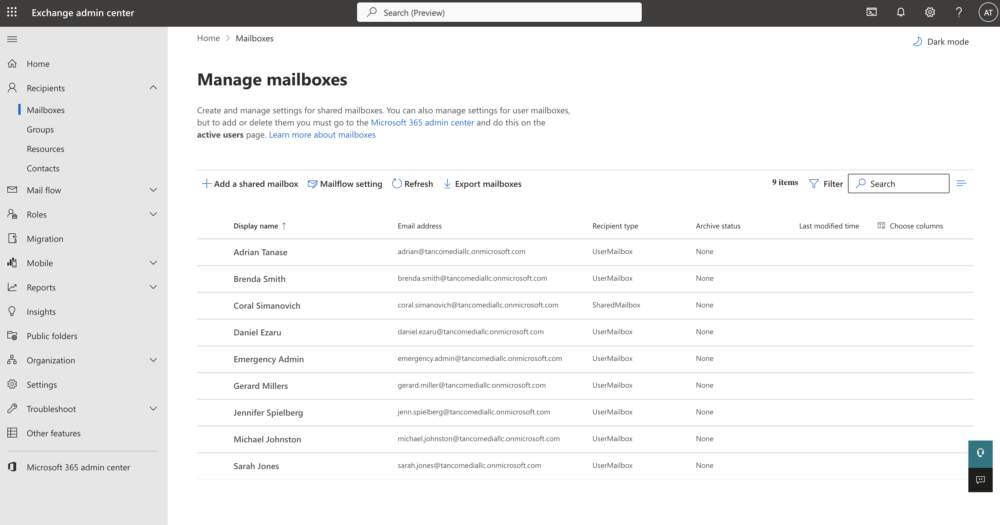
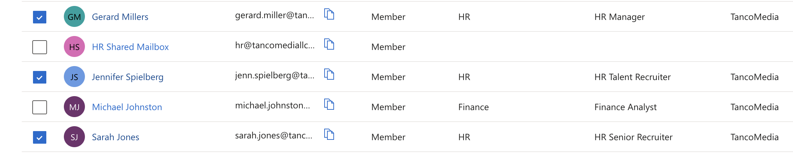
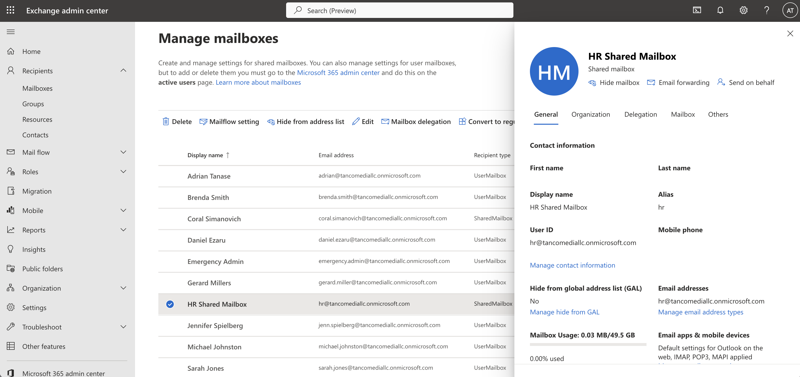
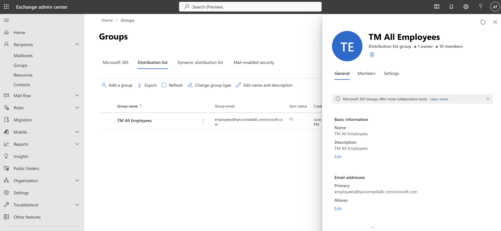
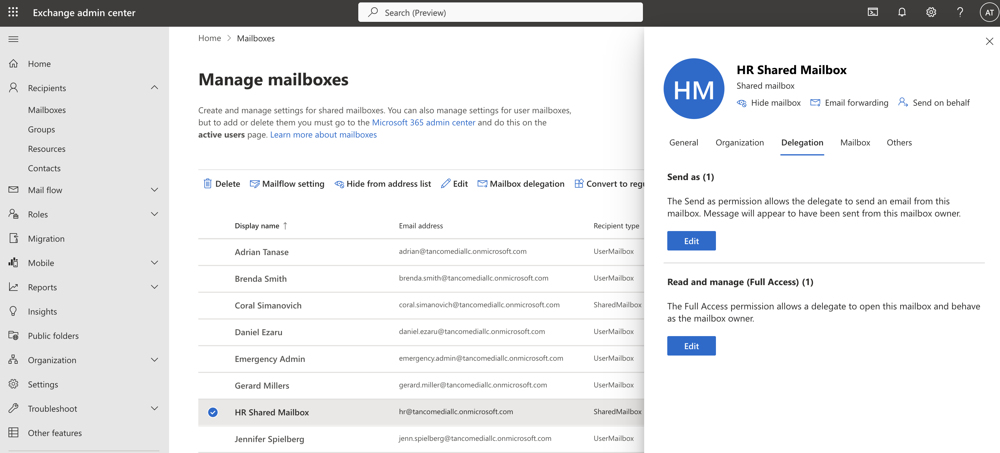
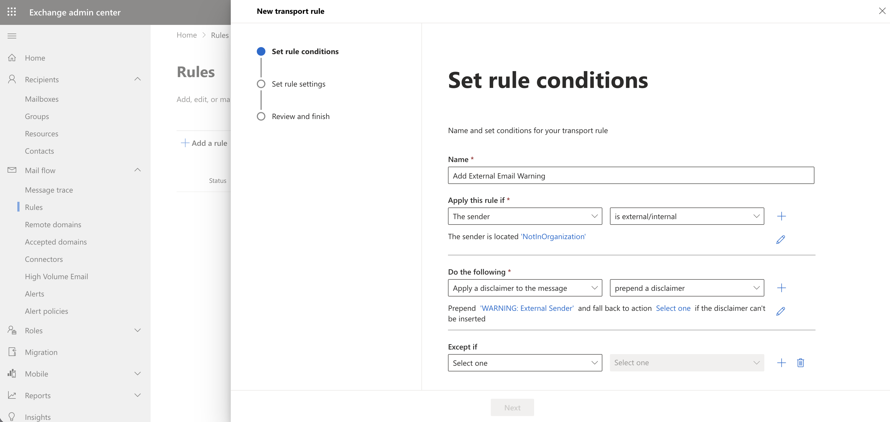
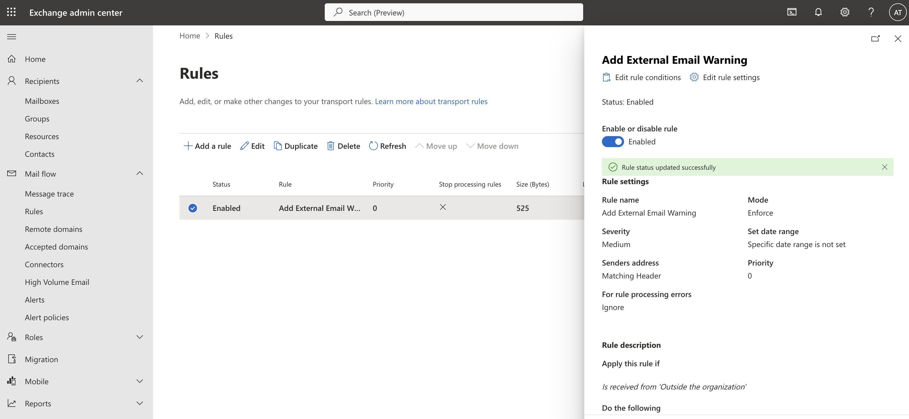
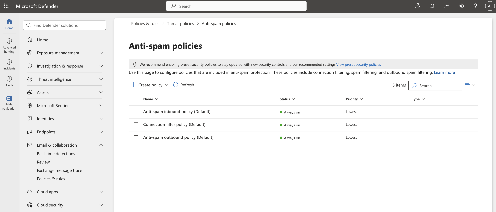

# 04-EXCHANGE-ONLINE-ADMINISTRATION

## Enterprise Mail Administration with Exchange Online

### 📌 Project Overview

This project demonstrates hands-on administration of Microsoft Exchange Online within a Microsoft 365 tenant. The lab focuses on mailbox management, shared mailboxes, distribution groups, mailbox delegation, mail flow rules, and email security policies.

The objective was to simulate common tasks performed by Microsoft 365 Administrators and IT Administrators in enterprise environments.

---

## ⚙️ Technologies Used

✅ Microsoft 365 Admin Center 
✅ Exchange Online 
✅ Exchange Admin Center (EAC) 
✅ Microsoft Defender for Office 365 
✅ Microsoft Entra ID

---

## Skills Demonstrated

✅ Exchange Online Administration 
✅ Mailbox Management 
✅ Shared Mailbox Configuration 
✅ Distribution Group Management 
✅ Mailbox Permission Delegation 
✅ Mail Flow Rule Creation 
✅ Email Security Administration 
✅ Anti-Spam Policy Configuration 
✅ Microsoft 365 Administration

---

# Lab Environment

### Tenant

Microsoft 365 Developer Program Tenant

### Administrative Role

- Exchange Administrator

### Test Users

- John Admin
- Sarah HR
- Additional test users for mailbox and group management

---

# Phase 1 – Exchange Admin Center Overview

Accessed the Exchange Admin Center through Microsoft 365 to manage organizational mail services, recipients, mail flow, and security settings.

### Screenshot

### Description

The Exchange Admin Center serves as the primary management portal for Exchange Online. It provides centralized administration of mailboxes, groups, security settings, and mail flow configurations.

---

# Phase 2 – User Mailbox Administration

Verified mailbox provisioning for licensed users and reviewed mailbox properties.

### Screenshot

### Screenshot

### Description

User mailboxes are automatically provisioned when Exchange Online licenses are assigned. Administrators can review mailbox status, configure settings, and troubleshoot mail delivery issues.

### Tasks Performed

- Verified mailbox creation
- Confirmed mailbox licensing
- Reviewed mailbox properties
- Validated Exchange Online provisioning

---

# Phase 3 – Shared Mailbox Creation

Created a shared mailbox to support department-wide communication and collaboration.

### Screenshot

### Description

Shared mailboxes allow multiple users to read and send emails from a common mailbox without requiring separate licenses for each mailbox. They are frequently used for HR, Finance, Support, and Sales departments.

### Tasks Performed

- Created shared mailbox
- Configured mailbox settings
- Assigned user access permissions
- Verified mailbox availability

---

# Phase 4 – Distribution Group Management

Created a distribution group to simplify communication with multiple recipients.

### Screenshot

### Description

Distribution groups enable administrators to send messages to multiple users using a single email address. This improves communication efficiency and simplifies group management.

### Tasks Performed

- Created distribution group
- Added user members
- Verified membership assignments
- Confirmed mail-enabled functionality

---

# Phase 5 – Mailbox Delegation

Configured mailbox delegation permissions for shared mailbox access.

### Screenshot

### Description

Mailbox delegation allows authorized users to access another mailbox and perform actions such as reading emails, sending messages, and managing mailbox content.

### Permissions Configured

- Full Access
- Send As

### Tasks Performed

- Assigned mailbox permissions
- Configured delegated access
- Validated permission assignments

---

# Phase 6 – Mail Flow Rule Configuration

Created an Exchange Online mail flow rule to improve email security.

### Screenshot

### Screenshot

### Description

Mail flow rules (transport rules) automate the processing of incoming and outgoing email messages. They are commonly used to apply disclaimers, block messages, route mail, and protect against phishing attempts.

### Tasks Performed

- Created transport rule
- Defined rule conditions
- Configured automatic actions
- Enabled organizational email protection

### Example Rule

**External Email Warning**

- Condition: Sender is located outside the organization
- Action: Add external sender disclaimer

---

# Phase 7 – Anti-Spam Policy Management

Reviewed and validated anti-spam protection policies within Exchange Online Protection (EOP).

### Screenshot

### Description

Anti-spam policies help protect organizational mailboxes from spam, phishing, malware, and malicious email campaigns. Exchange Online Protection automatically evaluates incoming messages against configured policies.

### Tasks Performed

- Reviewed anti-spam settings
- Verified policy configuration
- Validated email protection controls
- Examined threat management settings

---

# Administrative Outcomes

Successfully implemented and managed:

- User Mailboxes
- Shared Mailboxes
- Distribution Groups
- Mailbox Delegation
- Mail Flow Rules
- Anti-Spam Policies
- Exchange Online Security Controls

---

# Key Learning Outcomes

Through this project I gained practical experience with:

- Microsoft Exchange Online Administration
- Microsoft 365 User Management
- Enterprise Email Infrastructure
- Email Security Best Practices
- Mail Flow Management
- Shared Mailbox Administration
- Distribution Group Configuration
- Exchange Online Protection (EOP)

---

## Project Status

✅ Completed Successfully

This lab demonstrates core Exchange Online administration skills commonly required for Help Desk, IT Support, Junior System Administrator, Microsoft 365 Administrator, and IT Administrator roles.