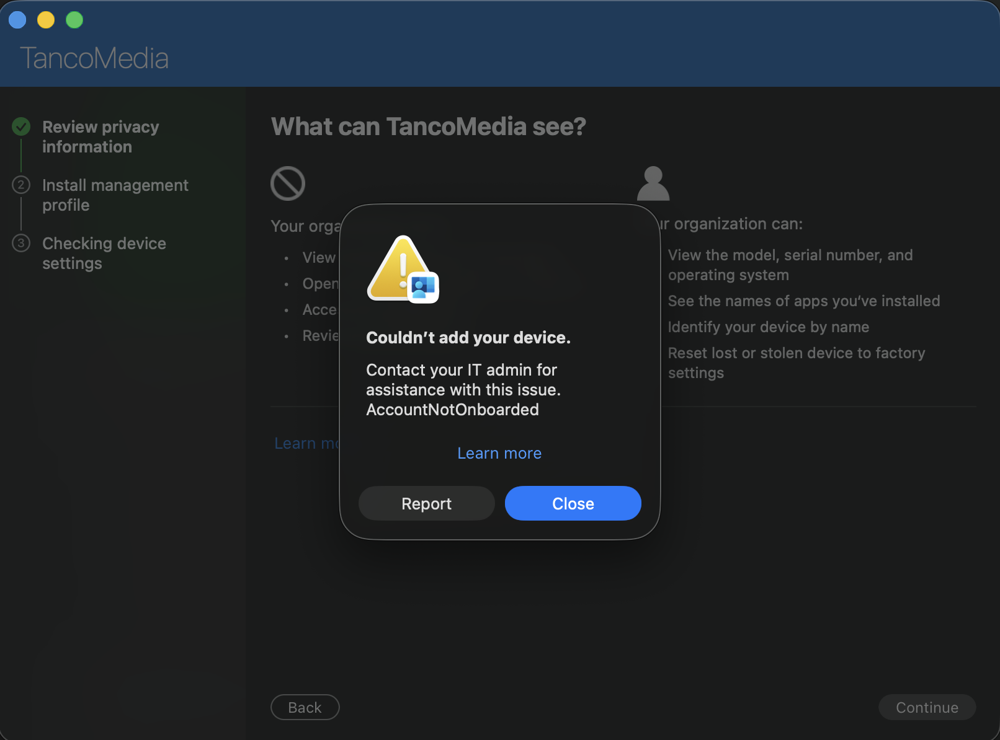
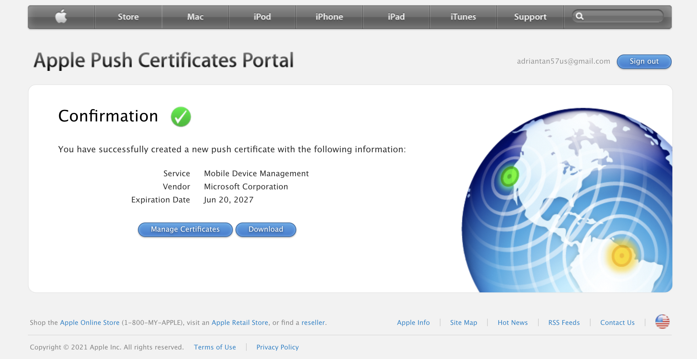
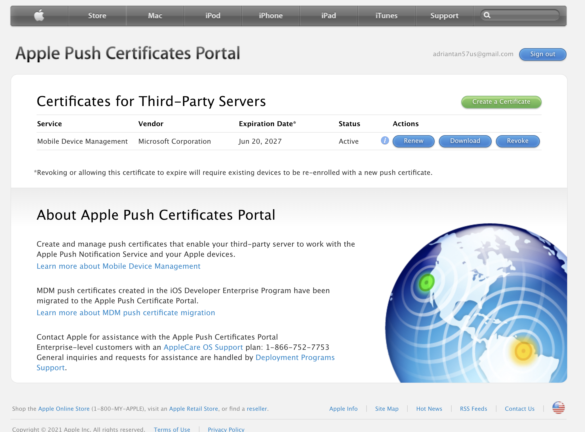
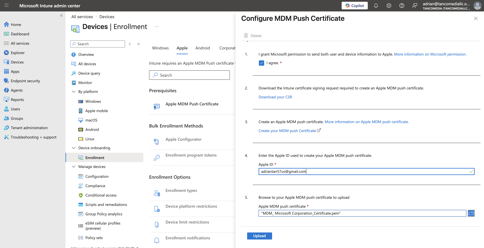
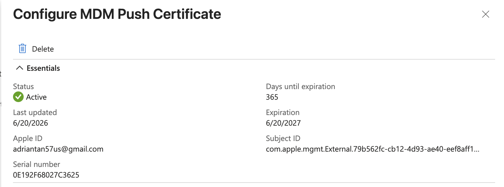
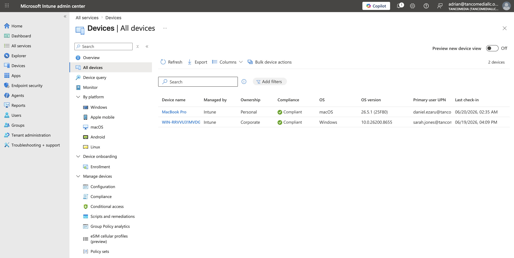
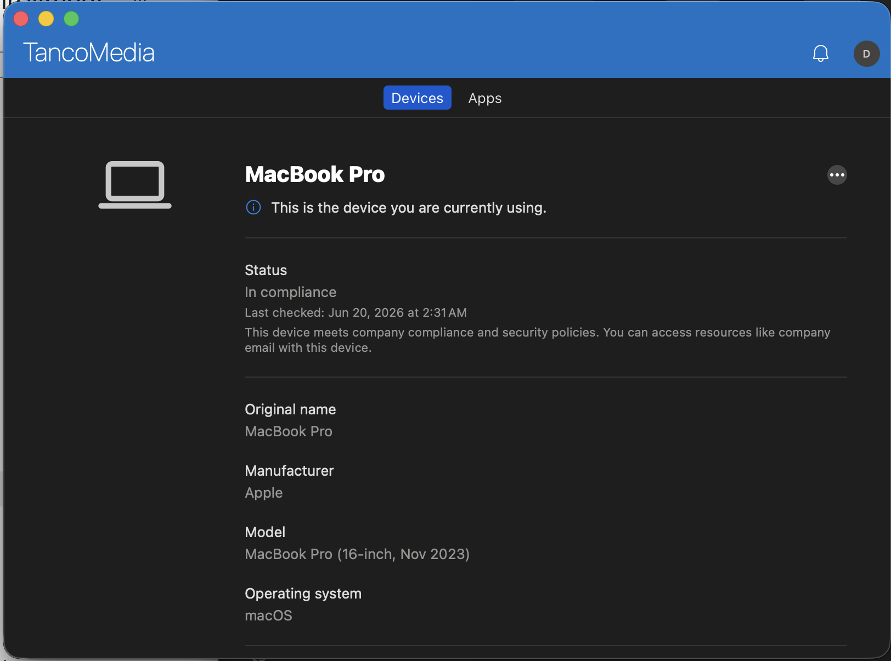
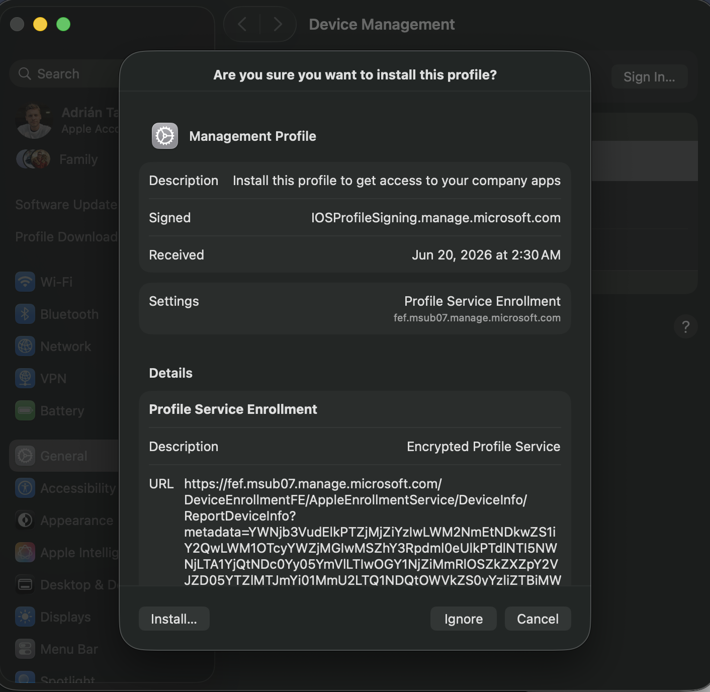
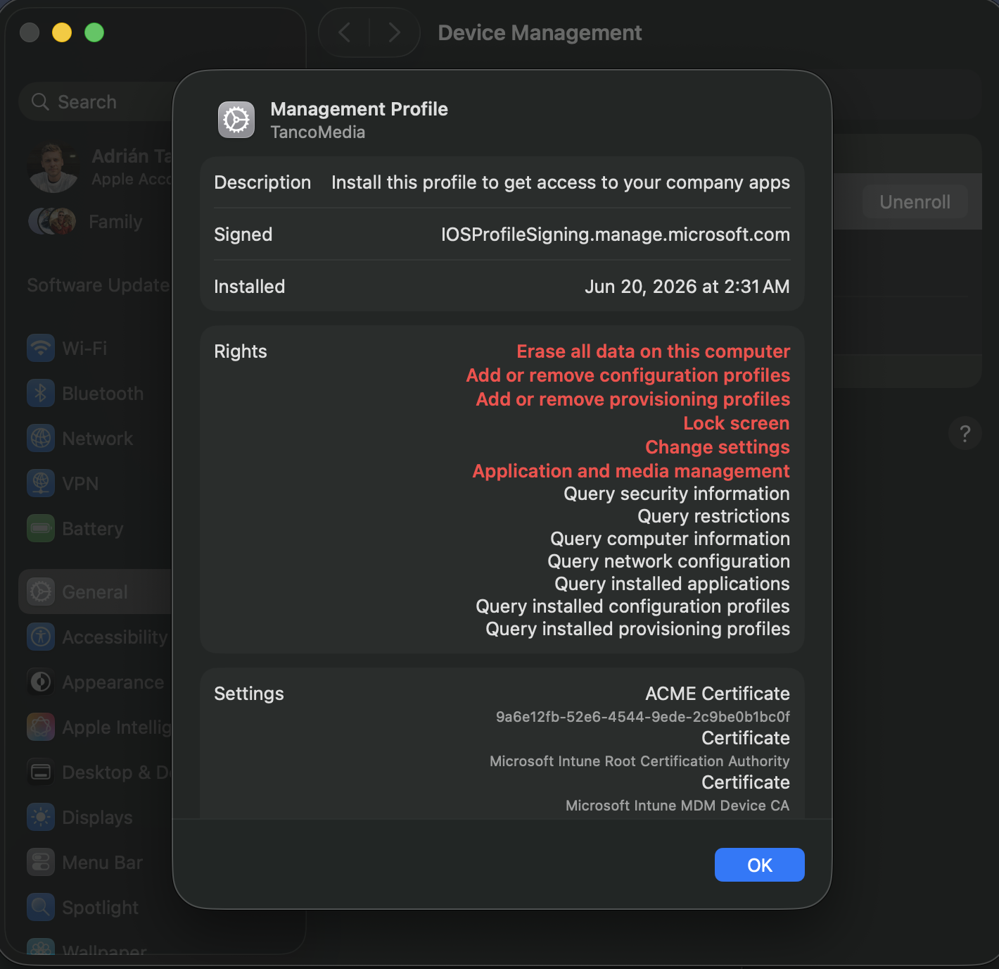

# Microsoft Intune macOS Device Enrollment & Troubleshooting

## Overview

This project demonstrates the successful enrollment of a macOS device into Microsoft Intune using Microsoft Company Portal.

During the process, I encountered and resolved an **AccountNotOnboarded** enrollment error caused by incomplete Apple MDM integration. This project documents the troubleshooting methodology, root cause analysis, remediation steps, and final successful enrollment.

---

## Objectives

- Enroll a macOS device into Microsoft Intune
- Configure Apple MDM integration
- Deploy required management certificates
- Validate device compliance
- Troubleshoot enrollment failures
- Verify successful endpoint management

---

## Environment

| Component | Technology |
|------------|------------|
| Identity Platform | Microsoft Entra ID |
| Endpoint Management | Microsoft Intune |
| Device | MacBook Pro |
| Enrollment Method | Microsoft Company Portal |
| MDM Integration | Apple Push Certificate |
| Operating System | macOS |

---

# Initial Enrollment Failure

After installing Microsoft Company Portal and attempting device enrollment, the process failed with the following error:

```text
Couldn't add your device.

AccountNotOnboarded
```

## Error Screenshot



---

# Root Cause Analysis

The error indicated that the Microsoft Intune tenant was not fully configured for macOS device management.

After investigating the Intune configuration, I determined that the tenant was missing the required:

- Apple Push Certificate (APNs)
- Apple MDM integration

Without an active Apple Push Certificate, Microsoft Intune cannot establish management communication with macOS devices.

As a result:

- Device enrollment fails
- Compliance policies cannot be applied
- Intune cannot manage macOS endpoints

---

# Verification Process

## Step 1 – Review Intune macOS Configuration

Verified the Apple enrollment configuration within Intune:

```text
Intune Admin Center
→ Devices
→ macOS
```

---

## Step 2 – Verify Apple MDM Push Certificate Status

Located:

```text
Intune Admin Center
→ Devices
→ macOS
→ Apple MDM Push Certificate
```

### Apple Certificate Creation





---

# Remediation

## Configure Apple Push Certificate

Generated and uploaded the Apple Push Certificate required for Intune MDM communication.

### Certificate Configuration



---

### Certificate Successfully Activated



---

# Device Enrollment

After completing Apple MDM integration, enrollment was attempted again through Microsoft Company Portal.

The enrollment completed successfully.

---

## Successful Device Enrollment



---

## Company Portal Device Status

The device successfully checked in and reported compliance.



---

# Certificate Deployment

As part of the enrollment process, Intune deployed management certificates required for device trust and compliance evaluation.

## Management Certificate Installation





---

# Validation

The following validations were performed:

✅ Device successfully enrolled into Intune

✅ Apple Push Certificate active

✅ Management profile installed

✅ Device visible within Company Portal

✅ Compliance status reported successfully

✅ Device management certificates installed

✅ Endpoint ready for policy deployment

---

# Why Enrollment Failed Initially

Microsoft Intune requires an active Apple Push Certificate (APNs) to communicate with Apple devices.

Without this certificate:

- Intune cannot manage macOS devices
- Device enrollment requests are rejected
- Compliance evaluation cannot occur
- Company Portal displays:

```text
AccountNotOnboarded
```

---

# Why the Solution Worked

Configuring the Apple Push Certificate established trust between:

- Apple Business Services
- Microsoft Intune
- The enrolled macOS device

This enabled:

- Device registration
- Profile deployment
- Compliance evaluation
- Endpoint management
- Certificate deployment

---

# Skills Demonstrated

- Microsoft Intune Administration
- Microsoft Entra ID
- macOS Device Management
- Mobile Device Management (MDM)
- Apple Push Certificate Configuration
- Microsoft Company Portal
- Endpoint Compliance Management
- Identity & Access Management (IAM)
- Enterprise Endpoint Administration
- Troubleshooting & Root Cause Analysis

---

# Outcome

Successfully integrated Apple MDM services with Microsoft Intune, resolved macOS enrollment issues, enrolled a MacBook Pro into Intune, validated compliance status, and established centralized endpoint management capabilities for Apple devices.

---

## Technologies Used

- Microsoft Intune
- Microsoft Entra ID
- Microsoft 365
- Microsoft Company Portal
- Apple Push Certificate (APNs)
- macOS
- Mobile Device Management (MDM)
- Endpoint Compliance Policies